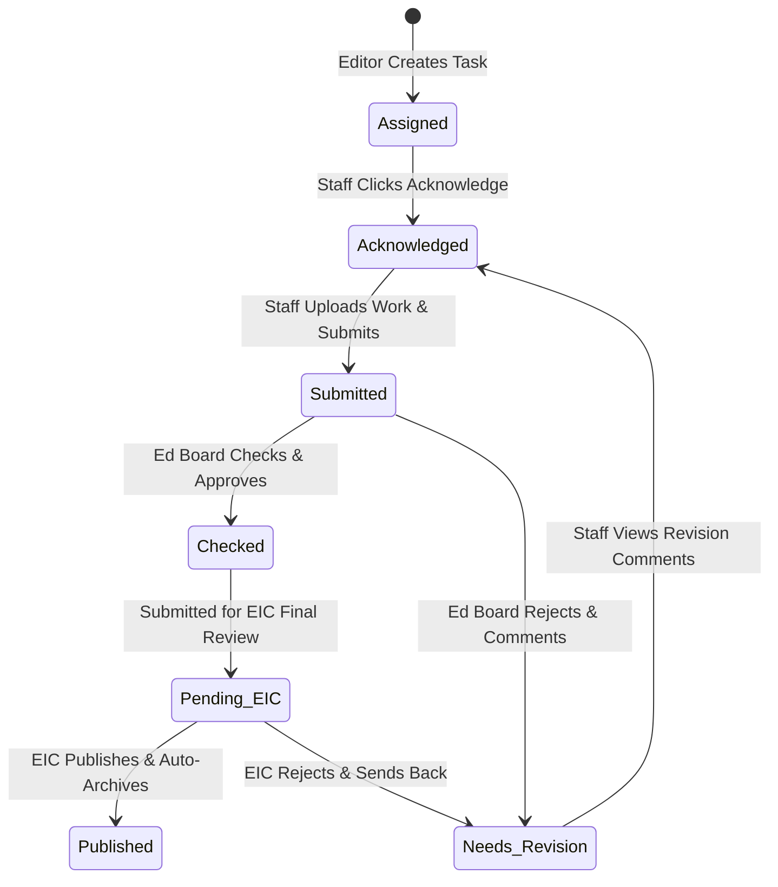
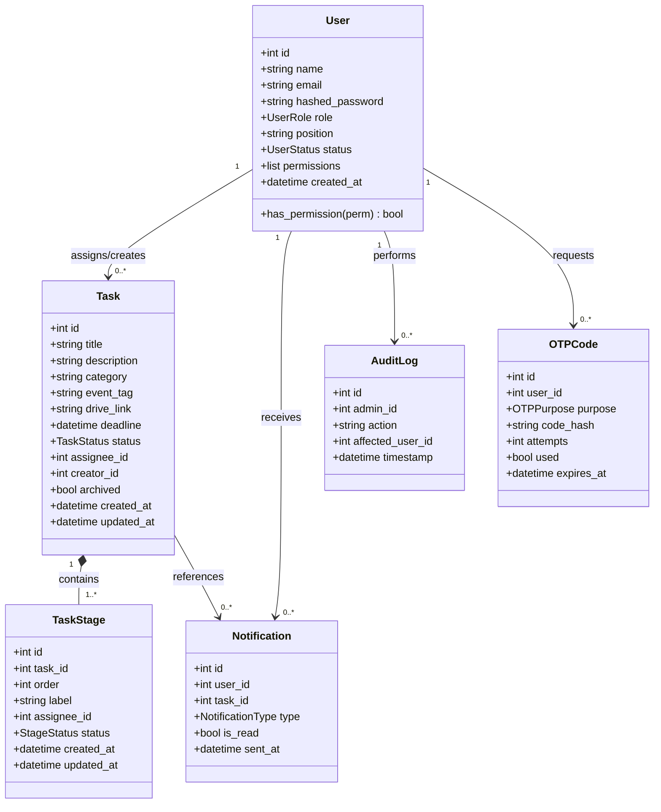
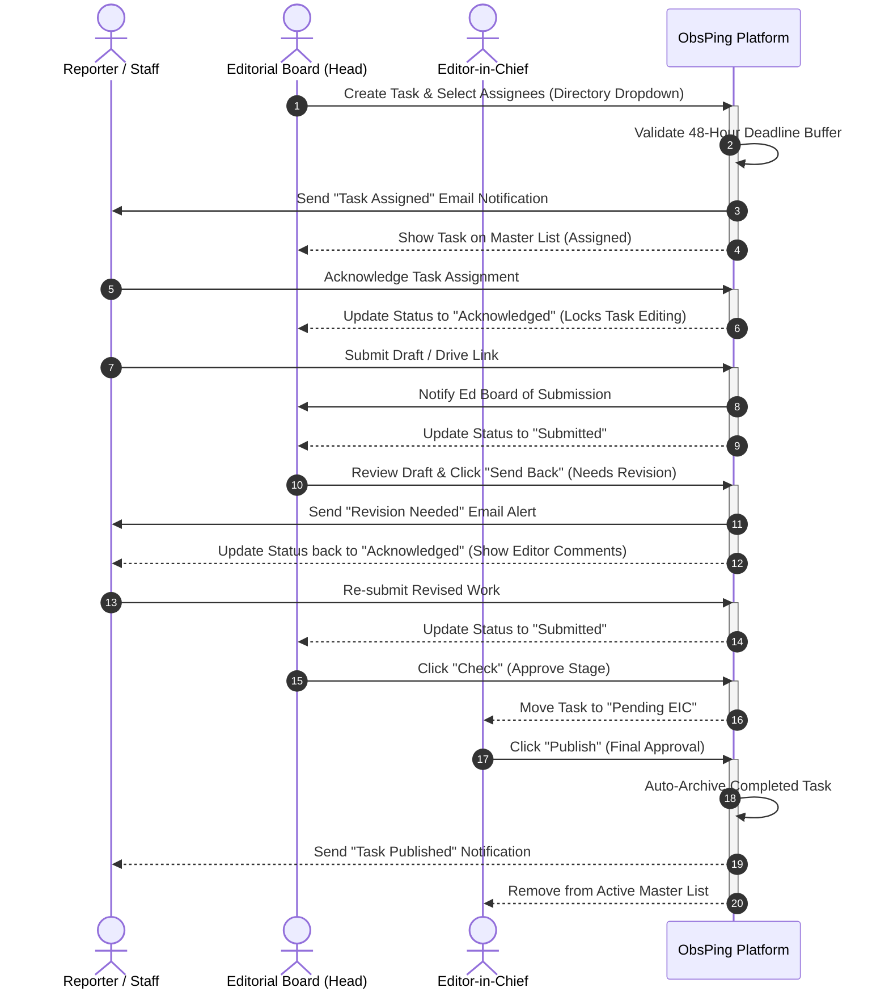
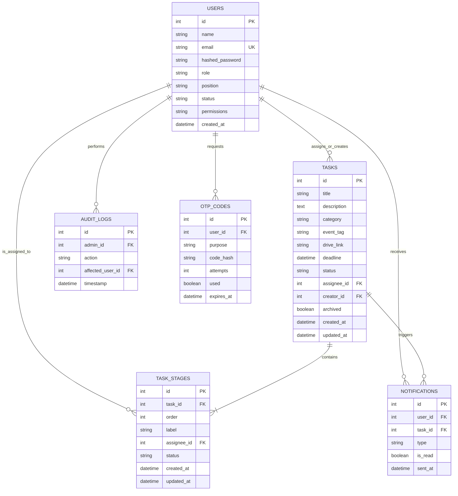

# **The Observer Task Assigning and Reminding System** {#the-observer-task-assigning-and-reminding-system}

Submitted by:

Labiste, Jonathan Jr. A.

Lacbayo, Mildred C.

Perida, Dixie Shanne L.

Software Engineering

Engr. Joseph Jaymel S. Morpos

Eastern Visayas State University \- Ormoc Campus

June 1, 2026

# **APPROVAL SHEET** {#approval-sheet}

**Project Title:** The Observer Task Assigning and Reminding System 

**Names of Group Members:** 

Labiste, Jonathan Jr. A.

Lacbayo, Mildred C.

Perida, Dixie Shanne L. 

**Statement of Completion:** This software project, entitled "The Observer Task Assigning and Reminding System", has been prepared and submitted by the group members in partial fulfillment of the requirements for the subject Software Engineering. It has been reviewed and is hereby recommended for oral examination and approval. 

\_\_\_\_\_\_\_\_\_\_\_\_\_\_\_\_\_\_\_\_\_\_\_\_\_\_\_

Engr. Joseph Jaymel S. Morpos 

*Instructor, Software Engineering*

# **ACKNOWLEDGEMENT** {#acknowledgement}

The developers want to express their deepest gratitude to the individuals who helped complete this project: 

* To Engr. Joseph Jaymel S. Morpos, our Software Engineering instructor, for giving us clear guidance, patience, and knowledge during the development process. 

* To the Editorial Board and Staff of The Observer, for participating in our interviews and surveys, which gave us the necessary details to build this system. 

* To our friends and families, for their continuous support and encouragement. 

* And above all, to the Almighty God, for giving us the strength, wisdom, and health to finish this study successfully. 

# **TABLE OF CONTENTS** {#table-of-contents}

[TITLE PAGE	1](#the-observer-task-assigning-and-reminding-system)

[APPROVAL SHEET	2](#approval-sheet)

[ACKNOWLEDGEMENT	3](#acknowledgement)

[TABLE OF CONTENTS	4](#table-of-contents)

[CHAPTER 1 \- INTRODUCTION	6](#chapter-1---introduction)

[1.1 Background of the Study	6](#1.1-background-of-the-study)

[1.2 Problem Statement	6](#1.2-problem-statement)

[1.3 Objectives of the Study	7](#1.3-objectives-of-the-study)

[1.4 Scope and Limitations	7](#1.4-scope-and-limitations)

[1.5 Significance of the Study	8](#1.5-significance-of-the-study)

[CHAPTER 2 \- REVIEW OF RELATED LITERATURE AND SYSTEM	9](#chapter-2---review-of-related-literature-and-system)

[2.1 Related Literature	9](#2.1-related-literature)

[2.2 Related Systems	11](#2.2-related-systems)

[2.3 Synthesis	11](#2.3-synthesis)

[CHAPTER 3 \- SOFTWARE ENGINEERING PROCESS	13](#chapter-3---software-engineering-process)

[3.1 Planning Phase	13](#3.1-planning-phase)

[3.2 Requirements Analysis Phase	13](#3.2-requirements-analysis-phase)

[3.3 Design Phase	16](#3.3-design-phase)

[3.4 Development Phase	16](#3.4-development-phase)

[3.5 Testing Phase	17](#3.5-testing-phase)

[3.6 Deployment Phase	17](#3.6-deployment-phase)

[3.7 Maintenance Phase	18](#3.7-maintenance-phase)

[CHAPTER 4 \- RESULTS AND DISCUSSION	19](#chapter-4---results-and-discussion)

[4.1 System Features	19](#4.1-system-features)

[4.2 System Screenshots	19](#4.2-system-screenshots)

[4.3 Discussion of Results	19](#4.3-discussion-of-results)

[CHAPTER 5 \- CONCLUSION AND RECOMMENDATION	21](#chapter-5---conclusion-and-recommendation)

[5.1 Conclusion	21](#5.1-conclusion)

[5.2 Recommendations	21](#5.2-recommendations)

[REFERENCES	22](#references)

[APPENDICES	23](#appendices)

# **CHAPTER 1 \- INTRODUCTION**  {#chapter-1---introduction}

## **1.1 Background of the Study**  {#1.1-background-of-the-study}

Managing task assignments and tracking deadlines inside campus student publications is often challenging due to informal and fragmented communication channels. Currently, the Editorial Board of The Observer relies on disjointed tools like Google Sheets for task logging and Facebook Messenger for tracking progress and sending alerts.

This manual approach creates multiple critical issues. First, instructions given on Messenger easily get lost or buried under casual conversations, leading to unreceived or forgotten tasks. Second, keeping up with staff progress requires constant manual follow-ups from editors, which often leads to missed deadlines and delayed publication schedules. Third, hand-typing names on sheets leads to typographical mistakes and misplaced assignments. Finally, because student rosters change annually, there is a serious need for secure role-based access control and account deactivation to protect student details in compliance with data privacy regulations.

To fix these issues, the developers proposed ObsPing (The Observer Task Assigning and Reminding System). This is a mobile-first, web-responsive workflow management platform designed specifically for the structured operations of a student publication. It features a centralized staff directory to eliminate typing mistakes, a 48-hour submission deadline buffer to ensure adequate editorial review time, automated email alerts, and a secure multi-tiered review dashboard (Staff -> Ed Board -> EIC) that complies with data privacy laws by deactivating (rather than deleting) graduated users.

## **1.2 Problem Statement**  {#1.2-problem-statement}

The existing process of managing articles and graphics in The Observer causes the following specific problems: 

1. Scattered Information: Writing assignments on Google Sheets and talking about them over Messenger separates the work data, causing editors and writers to lose track of details. 

2. Typographical Mistakes: Hand-typing staff names into tracking sheets creates errors, which can link tasks to the wrong student. 

3. Delayed Communication and Reminders: Relying on editors to manually message writers for reminders is prone to human forgetfulness, leading to late submissions. 

4. Lack of Real-Time Status Tracking: Editors cannot instantly see if a writer has acknowledged an assignment or if an item is stuck in review unless they send direct text messages. 

## **1.3 Objectives of the Study**  {#1.3-objectives-of-the-study}

**General Objective** 

To develop a simple and mobile-friendly web application that automates and centralizes task assignments and deadlines for The Observer. 

**Specific Objectives** 

1. Design a secure system with Role-Based Access Control (RBAC) and a two-step login (Email/Password \+ One-Time Password) to safeguard student details. 

2. Create a directory-driven task form that uses drop-down fields instead of hand-typing names to prevent typing mistakes. 

3. Incorporate a 2-day submission buffer logic to prevent editors from setting unworkable deadlines. 

4. Build an automated system that pushes notification reminders directly to the user’s phone via email when deadlines are 48 hours away. 

5. Provide a clear Master List dashboard with filters so that editors can check the progress of multiple articles at the same time. 

## **1.4 Scope and Limitations**  {#1.4-scope-and-limitations}

**Scope** 

The system can perform the following functions: 

* Secure Authentication: Two-step login using an email, a password, and a 6-digit verification code (OTP) sent to the student's inbox. 

* Directory Dropdown Selection: Pulls registered, active members directly into a click-to-select box for fast task delegation. 

* Automatic 48-Hour Alerts: Automatically calculates dates and sends notification emails when a task is assigned and when the submission time is 2 days away. 

* Master Dashboard Views: Displays active tasks in calendar format.

* Workflow Tracking Statuses: Moves assignments cleanly from Assigned → Acknowledged → Submitted → Checked → Needs Revision → Pending EIC → Published. 

* Super Admin Controls: Gives the Editor-in-Chief (EIC) tools to add accounts, promote members, turn off graduated student access, and pass down EIC controls. 

**Limitations** 

The system cannot do the following: 

* No Native App Store Download: The system runs as a web-responsive application via mobile browsers (like Chrome and Edge) and cannot be downloaded from Google Play Store or Apple App Store. 

* No Offline Usage: The application requires a stable internet connection to load tasks or send real-time reminders. 

* No Built-In Rich Text Writing: It acts as an organizing tool and reminder application; staff cannot type or compose their full articles directly inside the platform.

* No External Messaging Integration: The system handles its alerts internally via email notifications and does not connect with external messaging apps like Messenger.

## **1.5 Significance of the Study**  {#1.5-significance-of-the-study}

The completion of this software benefits the following groups: 

* Editor-in-Chief: Provides full oversight over the entire publication timeline, secures data privacy compliance, and allows smoother coordination of staff activities. 

* Editorial Board Members: Decreases the time spent manually writing assignments and tracking down reporters, letting them focus on actual article editing. 

* Publication Staff: Helps them see exactly what they need to prioritize through a clean layout, while automated alarms help keep them from missing deadlines. 

# **CHAPTER 2 \- REVIEW OF RELATED LITERATURE AND SYSTEM**  {#chapter-2---review-of-related-literature-and-system}

## **2.1 Related Literature**  {#2.1-related-literature}

1. Author: Allen, D.

   Year: 2001

   Summary: This book introduces the famous "Getting Things Done" (GTD) productivity framework. The core idea is that the human brain is great at creating ideas but terrible at remembering them. When people try to remember every deadline in their heads or through unstructured tools, they suffer from mental fatigue and become forgetful. The book states that to be truly productive, people must use a trusted external system that holds and tracks tasks for them.

   Relation to the study: This book supports the core function of the system's Automated Reminder functionality. By letting the web application calculate dates and automatically send out 48-hour email notifications, this take the pressure off the staff's memory. This directly mitigates human forgetfulness, ensuring articles are submitted on time without forcing editors to constantly text reminders.

2. Author: Osman, A. S. A., Osman, A. S. A.

   Year: 2019

   Summary: This research looked at how using an automated task tracking system inside a school environment changes the way people work. The study proved that when an organization stops using manual methods and switches to automated system tracking, it makes everything transparent. Because the system tracks milestones on its own, workers become more responsible for their actions, and the entire organization runs much more smoothly.

   Relation to the study: This study is highly relevant because The Observer is a student publication running inside a school framework. It justifies why moving away from manual sheets to an automated background tracker will make the publication staff more accountable, keeping them from missing dates and helping the editorial board manage tasks smoothly.

3. Author: Singh, S.

   Year: 2024

   Summary: This study focuses on how modern task management systems help people work better and faster. The author explains that when teams have a structured system with drop-down choice fields, clear status boards, and automatic tracking tools, it reduces stress and confusion. It changes overwhelming, messy physical work into an organized, highly visible digital pipeline where everyone knows what to do next.

   Relation to the study: This paper directly relates to the system because it supports the idea of replacing loose communication (like Facebook Messenger) with a digital pipeline. It proves that using structured drop-down menus and progress status tracking will lower confusion, keep the publication staff organized, and improve their productivity.

4. Author: National Institute of Standards and Technology (NIST) / Standard Computer Security Principles

   Year: 2010

   Summary: This security concept explains how computer systems should restrict access based on a person’s job role. Instead of giving every user access to everything, the system creates rules where regular staff can only see their individual tasks, while managers or editors are given access to administrative dashboards and control settings. This keeps private company or organization data separate from public views.

   Relation to the study: This principle justifies why the system separates views between the Editor-in-Chief (EIC), Editorial Board Members, and regular Publication Staff. It ensures that staff cannot tamper with the Master List, safeguarding the authenticity and security of the entire task assigning process.

5. Author: Republic of the Philippines (National Privacy Commission)

   Year: 2012

   Summary: This is a Philippine law that protects people's personal information from being leaked, stolen, or misused. It states that any digital system or organization collecting personal data (like names, personal emails, and phone numbers) must keep that information strictly secure. The data collected must only be used for the system's actual work functions and must never be shared with outside parties without permission.

   Relation to the study: Because The Observer system stores real student records—including school emails, full names, and publication positions—it must follow this law. The system satisfies this requirement by implementing a secure two-step login (Password \+ OTP verification) and giving the EIC the tool to turn off accounts for graduated students, making sure student data remains private and protected.. 

   

## **2.2 Related Systems**  {#2.2-related-systems}

1. Google Sheets (Current System) 

   * Features: Cloud-based cell tracking, collaborative tables, manual color flags.

   * Strengths: Easy to access, flexible layout, completely free to use.

   * Weaknesses: No automatic push notification reminders; easy for users to accidentally delete data or type names incorrectly. 

2. Trello / Asana (Commercial Tools)

   * Features: Kanban boards, task assignments, basic calendar attachments.

   * Strengths: Strong visual progress tracking, interactive user interfaces.

   * Weaknesses: Overly complicated for a small student publication, lacks custom buffer logic, and requires expensive paid fees for advanced features.

   

## **2.3 Synthesis**  {#2.3-synthesis}

The proposed Observer Task Assigning and Reminding System improves upon these existing tools by focusing solely on the school publication’s needs. Unlike Google Sheets, it stops user input mistakes by utilizing database dropdown menus. Unlike commercial tracking apps, it includes a strict, unskippable 2-day submission deadline buffer rule that fits the publication's editing cycle. It combines simple task tracking with secure two-step login methods without requiring any subscription costs. 

# **CHAPTER 3 \- SOFTWARE ENGINEERING PROCESS**  {#chapter-3---software-engineering-process}

## **3.1 Planning Phase**  {#3.1-planning-phase}

During the planning phase, the developers identified that the editorial team faced persistent challenges in coordinating task assignments, monitoring work progress, and enforcing deadline accountability. As active members of The Observer, the developers possessed direct, first-hand experience with these operational inefficiencies. The proposed software project was deemed highly feasible since all staff members own smartphones and use active institutional emails, requiring no specialized hardware procurement. The web-based deployment model further ensured minimal infrastructure costs. The project timeline was scheduled across the semester, allocating dedicated intervals for requirements elicitation, prototyping, backend and frontend development, system integration, manual testing, and final deployment.

## **3.2 Requirements Analysis Phase**  {#3.2-requirements-analysis-phase}

**Functional Requirements (FR)** 

* User Authentication & Role Assignment: The system shall require users to authenticate using a two-step login process: first by entering their registered email and password, then by verifying a 6-digit One-Time Password (OTP) sent to their registered email address. 

* Directory Management & Deactivation: The system shall allow the EIC to add new users, update the current roles of an already existing staff, or deactivate the users who have graduated instead of deleting them.

* Directory-Driven Assignment: The system shall automatically get the names of the staff from a database to a dropdown list to avoid typing the name of the staff manually when assigning a task.

* Internal Buffer Logic Validation: The system shall not allow the task assigner to assign a task that violates the 2-days buffer rule for assigning a task.

* Task Status Tracking: The system shall track the stages of the tasks, from Assigned → Acknowledged → Submitted → Checked → Needs Revision → Pending EIC → Published.

* Master List Dashboard: The system shall generate a central dashboard that groups every active task together based on their day of posting, just like a calendar.

* Master List Filtering: The system should have a sorting option for the Master List view to sort tasks on tags for easy navigation when trying to find a specific task or make a consolidated report.

* Master List Visibility: The system shall enforce the visibility of the master list through RBAC. Only the EIC, ED Boards, and Editorial Consultants can see the master list.

* Automated Reminder Generation: The system shall track the exact due date for every assigned task and the system should trigger an automatic notification to the student's phone when the deadline is fast approaching.

* Manual Notification Trigger: The system shall allow the Ed Boards to also manually send a notification to a staff about their tasks.

* Task Editing: The system shall let editors go back into an active assignment to fix the instructions or change the dates as long as the reporter hasn't submitted it yet.

* Archive, Delete & Notification: The system shall allow Ed Boards to archive tasks that are past deadline and also allow EIC to delete untouched mistaken tasks.

* Multi-Tiered Approval: The system shall lock the workflow so that an article submitted by a staff has to be reviewed by an Ed Board before the EIC can give it the final okay.

* Manual Task Status Changing: The users should be able to change their task status based on where they are in making the task.

* Auto-Archiving on Approval: The system shall automatically archive tasks that are approved and published by the EIC.

* Password Reset via OTP: The system shall provide a password reset flow where users request a reset, receive a One-Time Password (OTP) via email, verify it, and securely set a new password. The system must appropriately handle OTP expiry and validation.

* Audit Logging: The system shall automatically record critical administrative actions, including account creation, role changes, user deactivations, and task deletions, into a dedicated audit log.

* EIC Succession / Role Transfer: The system shall allow the current EIC to select a successor and transfer their role, atomically swapping permissions while strictly enforcing the constraint that only one active EIC exists at a time. 

**Non-Functional Requirements (NFR)** 

* Performance: The system shall fully load the Master List dashboard in under three (3) seconds on a standard 4G connection to prevent delays during high-usage periods.

* Security: The system shall enforce security controls like password hashing, session management, Role-Based Access Control (RBAC), and SQL injection prevention to protect user data and prevent unauthorized access.

* Usability: The system shall fit all the main buttons and text in a regular phone screen to eliminate the need for manual scaling to view task instructions.

* Reliability: The system shall target a an uptime of 99% and be designed to handle unexpected failures gracefully. If a server error or fault occurs, the system shall log the incident and recover without data loss, ensuring that no task records or user data are corrupted during an outage.

* Scalability: The system shall be built with the use of an organized and modular codebase so that future developers looking to improve the system can easily add new publication features without breaking the existing task dashboard.

* Availability: The system shall be reachable at all times. In the case of scheduled maintenance or an unplanned outage, a clear message shall be displayed to the user explaining that the system is temporarily unavailable and, where possible, providing an estimated time of restoration.

* Data Integrity: The system shall be built with a clean, well-documented, and modular codebase. This architectural approach is fundamental to guaranteeing data consistency and integrity, minimizing the risk of database corruption during read and write operations.

* Maintainability: The system shall keep the mobile frontend code completely separated from the backend database files. This architectural separation allows for the integration of new features without requiring modification of the core server logic.

* Backup and Recovery: The system shall implement a backup and recovery strategy to ensure that no publication data is permanently lost in the event of hardware failure, accidental deletion, or system corruption.

## **3.3 Design Phase**  {#3.3-design-phase}

This section maps the structural connections, behavioral workflows, and architectural layout of the ObsPing application using engineering blueprints.

### 1. Use Case Diagram
The Use Case Diagram illustrates the interactions between different roles (Staff, Editorial Board, Editor-in-Chief, and Editorial Consultants) and the system boundaries.

**![][image1]**

### 2. Activity Diagram
The Activity Diagram details the lifecycle of a task assignment as it progresses through the multi-tiered sequential review stages of the editorial pipeline, including rejection loops for revisions.

### 3. Class Diagram
The Class Diagram displays the static structure of the database entities and their relationships as defined in the FastAPI backend data models.

### 4. Sequence Diagram
The Sequence Diagram depicts the dynamic step-by-step collaboration between publication staff, department editors, EIC, and the ObsPing system during the assignment, feedback, and final publication processes.

### 5. Entity-Relationship Diagram (ERD)
The ERD illustrates the logical database schema layout, showing keys, columns, data types, and primary-to-foreign key relationships.

### 6. Interface Design / Prototype
The application interface adopts a clean, modern, and highly polished mobile-first responsive layout. Essential user flows rely on standard Web Accessibility patterns, such as fixed bottom navigation panels on mobile devices, persistent sidebar drawers for desktop controls, glassmorphic card overlays, descriptive status color badges, and interactive, non-blocking toast alerts.

## **3.4 Development Phase**  {#3.4-development-phase}

The ObsPing platform was built using a modern, decoupled, and highly responsive development stack:

* **Frontend:** Built using React.js (v18.3.1) with Vite as the build tool/bundler, and styled with Vanilla CSS and Tailwind CSS (v3.4.4) for a premium, mobile-first, and highly responsive user interface. It utilizes Vite-Plugin-PWA and Workbox for Progressive Web App capabilities (offering a standalone app-like experience on mobile web browsers), Axios for REST API communication, React Router DOM (v6.23.1) for routing, and React Hot Toast for micro-interactive alerts.

* **Backend:** Powered by the Python programming language and built using the FastAPI framework (v0.115.0) running on a high-performance Uvicorn web server. It implements SQLAlchemy (v2.0.36) as the Object-Relational Mapper (ORM) for secure database queries, Alembic (v1.13.3) for database schema migrations, signed JSON Web Tokens (JWT via python-jose) for secure user sessions, passlib and bcrypt for secure password hashing, and APScheduler (v3.11.2) for managing background automated 48-hour email notifications.

* **Database Engine:** Uses SQLite (`obs_ping.db` file) for local development and testing, and is fully configured to support PostgreSQL in production environments via the `psycopg2-binary` database driver for scalable, secure persistence.

* **Tools Used:** Visual Studio Code as the primary Integrated Development Environment (IDE), SQLite Viewer for database inspections, Thunderbird/Mailpit for SMTP email test monitoring, and git for version control and collaborative coding.

**Coding Process**

The development was conducted following modular software engineering principles. The backend codebase is strictly separated from the frontend codebase. In the backend, layers are decoupled into models, schemas, database connection utilities, service logic, dependencies, and API routers. This ensures that features can be added or refactored independently. Database transactions are managed using SQLAlchemy session dependencies, ensuring ACID properties, preventing memory leaks, and guaranteeing data integrity. On the frontend, reusable components (such as Custom Sidebar, Calendar Dashboard, Action Modals, Password Visibility Eye Toggles, and Task Forms) enforce consistent styling and state management, providing a unified and high-fidelity user experience.

## **3.5 Testing Phase**  {#3.5-testing-phase}

The system underwent rigorous manual and automated functional testing to ensure that all core features, security constraints, and workflow stages perform reliably under all circumstances:

| Test Case ID | Feature / Component | Description | Expected Output | Actual Output | Status |
| :---: | :---: | ----- | ----- | ----- | :---: |
| **TC-01** | OTP Login Flow | User enters valid email, password, and correct 6-digit OTP code. | Grants session token and redirects to the correct role-based dashboard. | Session token issued; dashboard loaded. | **Passed** |
| **TC-02** | OTP Login Security | Enter incorrect OTP 5 times. | Current OTP is invalidated; user is blocked and must request a new code. | Code invalidated after 5 failed attempts; error displayed. | **Passed** |
| **TC-03** | OTP Expiry | Attempt to enter verification OTP code after 10 minutes. | System rejects the code as expired and denies access. | OTP rejected; "Code expired" message shown. | **Passed** |
| **TC-04** | Password Reset | Request password reset via registered email, verify OTP, and set new password. | Invalidates old password; new password successfully authenticates. | Old password blocked; new password logs in. | **Passed** |
| **TC-05** | Directory Dropdown | Editor opens the task creation form and selects an assignee. | Directory dropdown instantly lists active staff, eliminating manual typos. | Dropdown list populated instantly with active users. | **Passed** |
| **TC-06** | 48-Hour Buffer | Attempt to set a task deadline less than 48 hours from current local time. | System blocks the save action, highlights the date input, and shows error. | Save blocked with "Deadline must be at least 48 hours away" alert. | **Passed** |
| **TC-07** | Task Editing Lock | Attempt to edit task details after the assignee has clicked "Acknowledge". | Editing form is disabled; task settings are locked to preserve integrity. | System blocks edits; "Task acknowledged" edit block enforced. | **Passed** |
| **TC-08** | Multi-Tiered Flow | Progress a task: Assigned $\rightarrow$ Acknowledged $\rightarrow$ Submitted $\rightarrow$ Checked $\rightarrow$ Published. | Enforces strict workflow progression (e.g., cannot check if not submitted). | State machine holds sequence; unauthorized jumps blocked. | **Passed** |
| **TC-09** | Self-Acknowledgment | Logged-in Editor/EIC assigns a stage to themselves and completes it. | Editor can successfully Acknowledge and Submit their own assigned stage. | Action buttons available and worked for self-assignments. | **Passed** |
| **TC-10** | Manual Poke Cooldown | Editor clicks manual "Poke" reminder button. | Dispatch reminder email immediately; disable Poke button for 60 seconds. | Reminder sent; button disabled with 60-second visual countdown. | **Passed** |
| **TC-11** | Auto Reminders | Set task deadline; background service checks at exactly 48 hours remaining. | Background service dispatches automated email notification reminder. | Service ran; reminder email successfully triggered and logged. | **Passed** |
| **TC-12** | Overdue Archiving | Editor archives a past-due task from the Master List. | Task is removed from the active Master List and moved to read-only Archives. | Task archived; active workspace remains uncluttered. | **Passed** |
| **TC-13** | Task Deletion | EIC deletes an untouched task (status is still "Assigned"). | Task is permanently removed from DB; in-progress tasks cannot be deleted. | Untouched task deleted successfully; in-progress tasks blocked. | **Passed** |
| **TC-14** | Staff Deactivation | EIC deactivates a user in the Admin Center. | User name removed from active directory dropdowns; login session revoked. | Account deactivated; dropdown updated instantly. | **Passed** |
| **TC-15** | EIC Succession | EIC initiates a role transfer to a new successor. | Successor promoted to EIC; old EIC demoted to Editor; swap is atomic. | Role swap completed atomically; recorded in Audit Logs. | **Passed** |
| **TC-16** | Sidebar Modals | On a mobile device, open side drawer navigation and click a modal (e.g. Audit Log). | Side drawer closes, but the modal displays fully centered and responsive. | Drawer slides shut; modal stays open, interactive, and readable. | **Passed** |

## **3.6 Deployment Phase**  {#3.6-deployment-phase}

The deployment process included the following steps: 

1. Database Seeding: Setting up the database using an accurate contact sheet provided by the administration. 

2. Hosting Setup: Deploying the web application online so it can be accessed on smartphone internet browsers. 

3. User Orientation: Holding a simple training session for the Editorial Board and Staff members to teach them how to log in and update task statuses. 

   

## **3.7 Maintenance Phase**  {#3.7-maintenance-phase}

Ongoing maintenance involves fixing minor bugs, monitoring email notification speeds, and ensuring that user data stays intact when the EIC reorganizes departments at the start of a new school year. 

# **CHAPTER 4 \- RESULTS AND DISCUSSION**    {#chapter-4---results-and-discussion}

## **4.1 System Features** {#4.1-system-features}

* Authentication: Handles secure, two-step logins and password resets via email verification codes.   
* Task Creator Form: Includes a drop-down menu for choosing staff and an automatic date validation tool for the 2-day buffer rule.    
* Master List Dashboard: Centralizes all ongoing tasks into list, grid, and calendar layouts for editorial management.    
* Manual Priority Alert ("Poke" Button): Allows editors to manually send an email reminder to a staff's phone for urgent tasks.    
* Super Admin Control Panel: Allows the EIC to adjust permissions, add accounts, and safely deactivate graduated members.

## **4.2 System Screenshots**    {#4.2-system-screenshots}

1. **Secure Login Page with OTP Challenge:** The gateway to the ObsPing application. It features a responsive layout optimized for mobile screens, custom password visibility eye toggles, and a two-step authentication form. Once correct credentials are submitted, it reveals a secure 6-digit OTP verification panel with an active expiration timer.

2. **Editor-in-Chief (EIC) Dashboard View:** The command center for publication leadership. It displays the master task calendar, active workload overviews, and access to administrative tools including EIC Succession panels, account management, and real-time audit logs.

3. **Editorial Board Dashboard View:** The operational panel for department heads. It features the Master List dashboard showing all ongoing tasks, visual status badges, progress tracking pipelines, manual "Poke" reminder triggers with a 60-second cooldown counter, and task archiving actions.

4. **Editorial Consultant Dashboard View:** A customized, read-only interface designed for advisors and consultants. It displays the full active Master List and Staff Directory to allow tracking of progress without administrative edit or write privileges, ensuring data integrity.

5. **Staff Dashboard View (My Tasks):** A simplified, priority-centric list view customized for regular publication staff (writers, layout artists, photojournalists). It displays all tasks currently assigned to the logged-in user, sorted chronologically from nearest deadline to farthest, with immediate buttons to "Acknowledge" and "Submit" work.

6. **Task Assignment and Editor Form:** The interface used by Editors to create or edit assignments. It features a click-to-select directory dropdown menu containing active members (avoiding typos) and enforces strict date-picker logic to block deadlines less than 48 hours away.

7. **User Directory and Audit Logs Management:** The administrative panel accessible only to the EIC. It provides controls to add new staff accounts, edit roles, deactivate graduated members, and review a read-only audit trail recording every administrative event with accurate timestamps.

## **4.3 Discussion of Results**   {#4.3-discussion-of-results}

The implementation of the system successfully met all project objectives. By moving task management away from crowded social media chats, instructions are kept safe, orderly, and accessible.  

The dropdown assignment system completely eliminated spelling mistakes when delegating tasks. The unskippable 2-day validation logic successfully blocked editors from setting unrealistic deadlines, giving staff adequate time to complete their articles. Most importantly, automated 48-hour email notifications reduced late submissions without requiring editors to constantly send manual follow-up texts.  

During user orientation and early deployment testing, the editorial board and staff of The Observer expressed high satisfaction with the system. Feedback indicated that the responsive, mobile-first design integrated seamlessly with their daily routines. Users reported that ObsPing effectively resolved the coordination delays and communication fatigue associated with manual sheet updates and social media tracking, proving to be an essential tool tailored directly to their publication workflow.

# **CHAPTER 5 \- CONCLUSION AND RECOMMENDATION**  {#chapter-5---conclusion-and-recommendation}

## **5.1 Conclusion** {#5.1-conclusion}

The Observer Task Assigning and Reminding System provides a reliable solution to the communication and tracking issues faced by the student publication. The system successfully automates task organization by offering an automated dashboard, strict deadline logic validation, and direct email alerts. 

The integration of role-based permissions ensures compliance with the Data Privacy Act of 2012 by keeping student information safe and confidential. 

Overall, the application functions as a reliable tracking platform that enhances efficiency and helps The Observer release its outputs on time. 

## **5.2 Recommendations** {#5.2-recommendations}

To further improve the system in future development iterations, the researchers recommend the following enhancements: 

1. Push Notification Integration: Integrate web-push alerts or SMS features so notifications pop up on phone home screens without needing an email application open. 

2. Cloud File Storage: Add a secure cloud upload feature so staff can drop their finished article drafts directly into the task card for review. 

3. Real-Time Collaborative Document Workspace: Integrate a lightweight online text editor so editors can review and leave comments directly within the platform.

# **REFERENCES**  {#references}

* Allen, D. (2001). Getting Things Done: The Art of Stress-Free Productivity. Penguin Books.

* National Institute of Standards and Technology. (2010). *Role-Based Access Control (RBAC) Security Models and Standards*. U.S. Department of Commerce.  
* Osman, A. S. A., Osman, A. S. A. (2019). Evaluating employee performance using automated task management system in higher educational institutions. Indian Journal of Science and Technology

* Republic of the Philippines. (2012). Republic Act No. 10173: The Data Privacy Act of 2012\. National Privacy Commission. 

* Singh, S. (2024). Optimizing productivity: An in-depth analysis of task management systems. International Journal of Innovative Research in Technology

# **APPENDICES** {#appendices}

1. **Source Code Snippets**  
2. **Questionnaire (if applicable)**  
3. **Additional Screenshots**  
4. **User Manual**  
5. **Testing Results**  
6. **Forms and Reports**

[image1]: <data:image/png;base64,iVBORw0KGgoAAAANSUhEUgAAAlkAAAGpCAIAAAAx4LSUAACAAElEQVR4XuydB3gUVdfHJ0BC7713qUoVpCsISBFBEFBBFERsdFSqgPTeQakiPXRI6L1IDSUgvQUIhEAC+XjVF1u+885xL3fP7G5m+0z2/J48ee6cc2b27s6c+5875V4lkWEYhmECG4UaGIZhGCbAYC1kGIZhAh3WQoZhGCbQYS1kGIZhAh3WQoZhGCbQYS1kGIZhAh3WQoZhGCbQYS1kGIZhAh3WQoZhGCbQYS1kGIZhAh3WQoZhGCbQYS1kGIZhAh3WQoZhGCbQYS1kGIZhAh3WQoZhGCbQYS1kGIZhAh3WQtOQwDCM4aF5y5gE1kIT8Ntvv9GEYxjGqPzxxx80hxnDw1podP755x+aagzDGJtnz57RTGaMDWuhofnrr79okjEMYwaePn1K85kxMKyFhoamF8Mw5oHmM2NgWAsNDc0thmHMA81nxsCwFhqX//u//6O5xTCMeeC7hiaCtdC40MRiGMZUwOkszWrGqLAWGheaWAzDmArWQhPBWmhcaGIxjE+4ePEiNbnBuXPn7t27R62BAWuhiWAtNC40sUzIiBEjKlWqlDdv3tdee23fvn3Emzp1akVRvvrqK2I3Ee/Yh4bqIzw8XFGhDofcv38fPrFbt27U4Tz46dOmTaMOl6hZs6YLXyfZwFpoIlgLjQtNLFMRGxuLjSBBjkkGWki/ngQN1YdrWpgjRw5c6/Hjx9TnJCtWrMifPz+1usqdO3eyZs1aq1Yt6ggMWAtNBGuhcaGJZSqEJKxater69etdunTBRdA/EZMMtHCxBfx20DkTFhqqD9e0EFcBPv/8c+pj/AdroYlgLTQuNLHMA7bLgwcPJvaQkBCwt27dGheFFi5btqxZs2ZNmzYdO3as9RoJZ8+ebd68+euvv/7FF18cPnxYdm3cuLFt27aNGjU6evSobAc9wEuUsG7Lli2vXbtm86IlMS5ZsuTVV1/94IMPLly4IEU9D+vXr99rr70mu2TwKw8ZMoTYZ8+eDXVo0qTJ9OnTievSpUvdunWrV68eBOzatQuNWi2Mj4+3WX/Bu+++C/FVqlQhKwrGjx8PP2/Dhg2nTJki27dt29a4ceM33ngDdgH8SmgcM2aM9rPgu8OP079/fygfP34cAh4+fAhl6IbKvw/EiJ2LnD59Wq788OHDsRwREQH79M0339y8ebMcj+CP1r59+6tXrz558gRWgVrRIDPAWmgiWAuNC00sk9CuXTt7jXKCRTMePHiQYNFCLWfOnAFvTEwMdUjbpA5FOXLkCLqKFi0q28GSIkUKLAg6deoEFtAhKOfOnVuOB9KlSyciiev5JqxBL9FC61X/R8mSJdFVqFAh4oIOdIJGC+E8AMqZM2cW29Qi4uvUqQOFl156Sbju379v2fy/wOlIgqqCxK5YPhH0SZQTbH2FoKAgxbIHQQupW6VatWq4+u7du9GCi6B/1oH/Ij4uY8aM1KfSokULEWMiWAtNBGuhcaGJZRKyZMkCjVfWrFmpQwWbtsjIyARJC6Hrg17o4aEFytBlgUK2bNnEurdu3cICrvjo0SNc3L9/v1grQdLC6OhotKAkQEOMiwmWakDAuXPn5HWB5cuXw+K3334rR8oBNsEYooWjR48W5Q0bNsjbgUKmTJmEF4QfC7IW1qhRQ17FJnFxcRAA/c4E6exBeCtWrKhIPxRw+fLlBEtt+/TpI+zQ28OCTS28ceMGLs6bNw8tRAvXr1+PAUJ9cdGmFqZKlQp6e/Lqd+7cwQBcDA0NxUXoo6OFtZDxNqyFxoUmlknAU3t7z19g04ZXNVHScubMqQ24evVq+/btsSwaYgSEE4yglLIRenKKtRYeO3ZMDggODhYBCeqnpE2bFgvAF1988TxU6mmJMtRHDtCCYdprpDLaze7YsQNVQSC0sHTp0lgg12wJ2bNnF9tMsDxEU7duXVyEji8sQidYnEYgeLEafhPt2w6yFtauXRvKUVFRckC+fPkUjRbKAbLFphYK3QUmTpwIFrz6jVoOX1x4gTNnziishYz3YS00LjSxTAI0W9r2UYAu6D0kWLRw2LBhckDKlCnB+PXXX0N55MiRGC8AI/QpiVGAW0AtlLeZYFFQvOGHPU60ky3IyAFiO/bAsCSvkSqWTUFfjdihP5ogaaHg/fffl7cpc/DgQUXtX5aVwLVEDJ4ECMqUKYP2Vq1ayXbFsoqshaVKlYIy3hoUtGnTRtGhhdjTtamFcvDp06fBAt86wdKnhJ0uB6CRtZDxNqyFxoUmlnnA5k/7fP+ePXsUtTuCi6iFxYsXl2Nw3b1798rGMWPG5MmTB+xLlizB9lfckdJiUwsTJFWD/9DKoxFvJbZt29YqVEKs5RgMk7XwwIEDiq0Ls2IRiYiIELKUIGlh586du3XrZnMVAXbvbIJnGzIjRoxA186dO2V7v379cEeg5slauGrVKihDB12Ot3m/UA5AiwtaiOcr4vBA8DIvayHjbVgLjQtNLPPQoUMHRb0tJBvFrSZxzU3cL5TDtBaBYnlnAPs64iYTMG7cOFF2rIUNGjSA/+Ka4cmTJ7WfeP78eVHWem2CYbIWTp06FSyHDh3CRVAaeVNr164VkQnSp5BnZ4oVKwZle+/nYeRDa65fv66oj5XS6ISEAgUKgGvQoEG3b9+W7ShImzZtSrBzv7BSpUq4KHqZ3tDCBMu6adKkwUX8+gprIeN9WAuNC00sUwFtJbZiBDkGtbBZs2Y2YzJkyEDswpVgaTRlRA/MnhbKD1XKdvGAhgA6i+J5E7TI8TbBMMfXSMXjrDZ/nB9++CFBo4XAt99+q1g/Q4Rg/8zmHcoKFSoo6o1GEBXpE/5HxowZEzQVQ3BdooXQVytZsqSIKV++/EcffaR4TQsTLI/OIunTp8ebiB988IG0kmlgLTQRrIXGhSaW2YCGElpq0a7hmxIyqIUHDhz4+uuvMaZ06dLysyTQDrZu3RpdjRs3li+6QlhoaCi66tatGxcXJ1z2tDDB8owraBKxw9ZmzJiBW3vrrbdkFxpli00wjCgT1Aq/Y9myZaHyeEkTXfCJ77//Pq6lSE/SarUwwbLxGjVqaI2yRYA3I/HNEOiOi86c2AXw6dAzhu4m2r/88kvxsxMtFEANMSZv3rwQgD+4N7QQeawChZs3b0LAwoULSYApYC00EayFxoUmFsP4nHLlysmL5JUJj9O5c2dyp9OrH+dtWAtNBGuhcaGJxTA+B6UIqFixonhUZ+PGjTTOQ4iPA1544QUsvPLKKzTOJLAWmgjWQuNCE4thfM6TJ0+mTZuGD/Eq6gO3d+/epUEeZevWreLibfXq1Q8cOEAjzANroYlgLTQuNLEYhjEVrIUmgrXQuNDEYhjGVLAWmgjWQuNCE4thGFPBWmgiWAuNC00sxsCMHz++d+/e1OoGZPIjxoywFpoI1kLjQhOLsQYfr6BWP4GVwRn+XEP+OtWqVVMs8yt5j/Dw8GnTpu3bt486GA/BWmgiWAuNC00sxhoHWoguwk8//UTjPAd+BJlSwylwC1g+cuSIos4vYR3iMcRvIkODdBMXF7dlyxZ59gkGYS00EayFxoUmFmONgxYcXTt27Liucvjw4UaNGjmINwI+q17WrFnhg2bNmoWLoGTDhg1z56OjoqJg9VatWlFHwMNaaCJYC40LTSyTExMT07NnT2zxFeupmm7fvo3G+Ph4HLQTuHTpkrT2/zh16pRY3eboXwJ0kZ4KGocPHy4sYsCzjBkz4hR6cuS0adPEHIrly5dH19y5c9FSt25deTIjNGL5xIkTuLht2zZ8P71YsWLaGRDFyHM4WJq8BVz8/vvvRRldxYsXx7J2rGqc5w+ZOXMmzgMsZiSWUWyNQgdER0fj6sQuGwcNGmT5EAXvj4pFgVhxwYIFwijPwrh9+3ZFnc959erVuLubNm2KLjFLV/r06bXznJgO1kITwVpoXGhimRzRLAoWL16MLqGFBBAesTo0l7ILR6ZWNA03gi6bWohTwCfYmvBINL64SAYHL1KkCJkLULGWLrEotJBw5MgREY93BLWIAEWjheIsAZFnrcIZGWVwUl97WqhYT3YvwK8sDwkLcq5YphyRNv8v9oyAfN6DjBgxAl2ohdqx1zt37kwsllqYFdZCE8FaaFxoYpkceSIkIGfOnIql2RVaKE+VhxbUJ5wqAfRPeHGEaHvNJbpsauGcOXNE+bvvvhNenAVXjhSLQIkSJYgFJ5Q/e/YsLspeoYVCXD/99FM5oEqVKlCePHkyLibYmr5K0WghxAhv5syZFbVrBeXPPvuMrJtgWcWmFkIPFb3Ixx9/LM9cj0ayCLsJOmpQqFy5snAJtNdI+/TpAxb5qZy0adPiZyVYtFD+FDGfhrDs2rULFmG/C4sZYS00EayFxoUmVrLgiQWcWvbcuXMJkhbKkWi5d++eKKOMIXFxcdpVBOg6duwYflZ8fHy2bNnkeCyLygC4wdmzZwuvPGsgNvdVq1YVFlBBsAwdOhQX5Y0LLRTBJEDrxWlsZaOi0ULhArZs2QKWKVOmCK88g6Mw2tRC4MaNG6JjLUBX+fLlFalrqFhOQUSnrVy5csKLaLUQI+Wf9+7du4rlyVjUQvmZW3FpVFgSbH1r08FaaCJYC40LTSyTM3z4cGzdZE6ePJngUAujo6NFWfbaMyLo0iKm/6UOCy+//LLwvvvuu2SbPXv2FIvXrl0DS/fu3YVX0aGFeItR69UaFYdaiLdO8d4nenfs2CEHYLfVnhYKQkNDxRDYaLl165Zi6aDjBVLcBQmWzqhATGFhTwttkmDRwgULFoh4/CD0CrQW08FaaCJYC40LTSwzs2zZMtK0TZw4UXFSC+UrqOJRkecrSKBLXCOtXLmyYt2txAAhjQT0dujQgRj79u0rFt3XQrl3Bd1fsoqiWwvFPIhyAFpsaqE81yMyePBgxTLjYIJlXXw6qXr16tax/4LzSuINXa0W5s6dG7cgLDKohT/++KOwsBYyfoe10LjQxDIzM2fOVCyPYCDp0qVTdGuheBCDeMkqAnQJLQTVwQdPcDZ2oHDhwmR1+eYiurynhaheuXLlIl55FUW3ForrqyVKlBg1ahRUybIx21qYOnVqMncu2T6+dIF3+KSohBkzZogyTmSI1zmxAsWKFRPevXv34haEZdGiReLrsBYyBoS10LjQxDI52LRVqVKlTJkyWFZ0ayGQMWNGsZaMvIoAXbK8QaeHxKdMmfL5VlTw3YYE72thgq1PR+R4nVoIgMaTZ1zxVEN+gQSBrrAcJiOHaY3aZ2hlr9ZInvuVXayFjAFhLTQuNLFMzqNHj0SbGBISgl0H/VqYIL2QB8TGxmpXEaDL5nOkXbp0wUXoLL733ntoROQHRhQvayF8liyH4seR4/VrIQI6N3jw4N27d8PGcZXVq1fLAYh47EhQr149+YJtgvTCibBADV988UV5rRUrVgjv0KFDhV0YX3rpJWGELyuuzbIWMgaEtdC40MRiGDtkyJBBvoDp+CFbB+BbEGIcAzjhoBGMM7AWmgjWQuNCE4thbHHs2DGULsLUqVNpqEPkjruiXs2mEYyTsBaaCNZC40ITi2HscPnyZTEaALJr1y4alBRRUVHism27du2om3Ee1kITwVpoXGhiMQxjKlgLTQRroXGhicUwjKlgLTQRrIXGhSYWwzCmgrXQRLAWGheaWAzDmArWQhPBWmhcaGIxDGMqWAtNBGuhcaGJxTCMqWAtNBGshcaFJhbDMKaCtdBEsBYaF5pYDMOYCtZCE8FaaFxoYjEMYypYC00Ea6FxoYnFMIypYC00EQGqhSVLFi9evKj8V7VqZRrkb2himYdffvll9+7dYS4RHh4O68IW6EYZxmz4XQvbt29LGroKFV78+++/aRwTmFr44ovl4Zjo1asHLj59+rR582Zg6devn3Wgn6GJZWyio6MPHjxIlc1tYJtkOiGGMQv+1cKaNV+BZq1bt664+Ndff7Vt2wYV0TqQ+R8Bp4U9enS3eSicOhUB9qdP/XnsEmhiGRIQqlOnTlEF8wJnz55lUWTMhR+1cNiwb6FBK136BWK/ePEi2A8dOkTsTMBpoYPTIgcuv0ATy3js2LGDSpaXiYiIoJVgGKPiRy100Jr16dOrRIli1BrwBJYWzpgxHY6PmJgY6lAZOXIEeP/55x/q8BM0sQzDhQsXqEb5nPj4eFothjEY/tXCEyeOU6sFezIZyASWFg4fPgwOAnsH6Pbt28B7+/Zt6vATNLGMwbFjx6gu+Ynjx4/TyjGMkbDX1PgAaMr++9/fqdUCa6GWwNLC0NBVcBDcuXOHOlQGDOgP3j///JM6/ARNLH/z5MkTKkf+ZuvWrbSWDGMY/KuFYWGbqNUCa6GWwNLCRIeX0R24/AJNLL9y5MgRKkSGgZ+pYYyJf7XQXmvWuHHDUqVKUmvAE3BauGbNajhEzpw5Q+zjx48D+7Nnz4jdj9DE8itUfwwGrS7DGAA/auH27dttyuGiRQuKG+lOkHEIOC0EateuhUdJXFwciN/p06dxccmSn2ioX6GJ5T/27t1LxcdgHDhwgFaaYfyNH7UQaNOmNTRrZcqUevr06R9//HHjxg1s6LQCySQGphYC5cuXFYcF/n355ec0yN/QxPIT3r5NuHz58oEDB1Kr8zx+/JhWXUPJkiUVRfn888+pg2G8gH+1EDh8+DBp6Nq0eds4j8obioDTwj///BMOUGjfoemMj4+HruGjR48eqsCxa6jRiWhieQH4ERQL9rSEak5SvPbaa3nz5qVWn0CrbgF2N9RKfNMHDx7QCIbxAn7UQmjKnj593tBBUycaOmj0jPOEoHEIIC08efIEOUWy+VeyZHG6pp+gieUdhEIAL7zwAnV7QguzZs0KG0+fPj0u5sqVS3ximNovHDBgABRg8aWXXoL/OXLkkNZ2Alp1lVOnTomPy5IlC7+YyPgMv2jhrVu3Xn65irZl0/5NnTqFrhzABIoW1qhRHXd/69atZs+eOWfObPI3cuSIrl0/btTodQybNGki3YTPoYnlNbp37y7UAvj666+Fy4ULpEQLc+bMWb58eSjUq1cvQ4YMlStXzpgxI7oUjRa2bNkSCkFBQaNHjxZb0I/0nZ4jfzUBfETx4sWbNWs2atSopUuX7tq169y5c3RNhnEP32vhK69UwxasRYvms2bZaOhGjx7Vs2f3xo0bYdigQQPoJgKV5K+FUVFRuNfj4uKozw7nz5/HVajDt9DE8hxHjx6tWLFiSEgIlQgV+PpyMBWcpCBaCBucMGECFEByoJw7d+5q1aoJV5i1FqK9SJEiLVq0+Hd9Z5CrLcicObP193ORFClSZMqUCb5auXLl3n333UmTJu3bt49+GMNI+FgLsdWKirpFHfYxQkNnEJK/FuLOdvag3LRpI6zVoEF96vAhNLHcIzY29sMPP6QNvIXChQtjYeDAgWRFKjhJAVqYNWvWASrDhg1r2rQpdMKg+xUcHFypUqXFixfDp4A+pU2bVvGJFgI1a9bEb9e1a1e0wInRyZMnQ0NDoRPcrl272rVrw4dijPvAj1m/fn34rFmzZm3cuDEiIoLfgAxMnG123OHmzZvQZP3+u92xZmzyyy+/wFr1679GHYFHQGjhzJkzqFUHOMchtfoQmljO8/DhQ2iRaVNtIX369KBVCdITNBUqVKCbSEg4fPgw1RyHNGnSJIOFYsWKgWX69Onp0qUbOXKkiFm5cmWY1C8cMmQIFCAevWXLln3nnXdEsE5OnDhBqy7RqVMn/I6lS5emPoecPn0aJK1Dhw5ZsmSBXyx16tTiB3QTkMz33ntv5syZp06dio6OfvDgAd/LTGb4UgtLlSrZrdsn1KqDWrVqQEP3119/UUeAERBaSE36AIVweV2PQBNLB3PmzKlatSptdC2MHTsWeodkFeiyoHfz5s3EJdiyZQtVHleZMWOGqM+4ceOo21W2b99OK61hx44d+LnU4WmuXLmyc+fOBQsW9OjRAzq4cIYBPWPxrd0hX758NWrUaN++/TfffLNixYojR47cv3+ffjxjGHymhf/5z3/caaxg3Xr16lBrgMFa6Ah31nUfmlh2gAYROrC01VQJDg7u168fXUGDot4Mo1YJF56g8TG0xmbgzp07a9asAVXDO6zQ70yTJg3dhS4B0vv222/Dqc/u3btBmG/fvo2vDDE+xmdaeO/ePXcaK7yRRK0BBmuhI9xZ131oYklAn7V69er2Hn6Bjgh5/sV9tm3bRvXHMMTExNDqmp/4+Phbt26dPXv2wIED06dP79y5c+XKlemedpVcuXKVLFmyatWqvXv3Xrx4MXwK/XjGE7AWmojA0kI9+9vZeO9B8io6Olrc9NICDeXMmTPJKi4AnZU5c+ZQq8rOnTupChmAXbt20YoGGBcuXNi4ceOECRPatm1bt25dELkMGTLQ48MloLcK/cv+/fvPmzdv7969ly5dsjcgA2MTf2lhkg0XXlP9+eefcZG1MJG1UIuz8d5jzJgx+fLlo+2ThT179nh2/JSIiAixceqz8OTJk61bt1I58h/8fKZr3L9///r165GRkevWrRs0aFDjxo2zZ88uHVyuExISAp3OokWLvvzyy999992WLVu0t6gDB59p4f37VAsdjywDp7wQs3nzJlxkLUxkLdTibLxnWbx4cZUqVWgDowKtzNSpU710Yg69K/mzhg4dSiMkdu/eTUXJ50BTTqvFeIEDBw7AMfntt9+2atUK5C1PnjzyceIywcHBr7zyynvvvTd48OC5c+cePnw4KiqKfrb58aEW3mctdBPWQoqz8e4DOWOviYEmo2LFijTDPI08KBqSKlUqGqQhPDycCpRPgM/l7qDRgHOpESNGNG3aNEuWLGnTpk2ZMiU5olymfPny0L+E7d+8efPu3buPHj0y0d43uBauXbsGF1kLE1kLtTgb7yw3btzo1auXvTs6H3/88cmTJzGSJpZ3mDhxIn40VEyuic4WB9bavn071SsvsGPHDmgN6ccz5iQ2NnbPnj2LFi0CnevcuXOlSpVAROXDz2WCgoIKFSoEqvzpp5+OHTt25cqVV65coR/vK/yqhX9Ifgpq4apVK3GRtTCRtVCLs/F6ePbsGaQlzVoLuXPnhlaeruMrLQSmTJkC//PmzYv1mTBhAvwvUqQIjXPIvn37qHx5CJBb+mFMYAAnZIcOHerXr1+9evUKFy6cK1cuT712oqhjHbzzzjvLli07derUpUuX7t275/EbEH7Uwj/+SFoLly9fhoushYmshVqcjXfA0KFD4RSVpqAKnL2eOHHC8XUMmlheBitWu3ZtUaYROoDGC5oV95+vgS1ER0fr7JsygQkcHiBgZ86cOXjwIEgaSGa5cuWe55h7pE6dOmfOnGXLlq1bt27Pnj1//PFHF17d8ZkWxsS4ooVLly7BRdbCRNZCLc7GE06ePFmqVCmaWCopUqRo2bIlXcE+NLG8DFby9u3bWP7kk09ohPM8evTo6tWrx48f3717t703FMG+f/9+iLl27RoPQsZ4Aziqd+3aNXLkyE6dOjVq1KhIkSKeGksvODgYBBjyeuzYsUuXLoXjHDMI8aEWxrighYsX/4iLrIWJrIVanIp/+PBhrVq10qVLR1NEpV27drdu3XJ5Fmkpl73OkSNHsM7UwTABSWxsLCRvZGTkjh07Ro0aBWqXKlUq6/x2EdhOpkyZ8uTJAyLauXPnH374AU4BafI7iWtauHDhAlxkLUxkLdSSZPz58+d79uwJnTx6jKsULlwYzkDpOi5Bs9OblClTBiq/Zs0a6mAYxj73798/fPjwsmXL+vbt26ZNm+rVq9t7LM5ZoIUpVqwY9GIHDhw4b948kOSrV6/SNsKCVgufPXsm+SmohfPm/YCLrIWJrIVakozXPvCWMWPG48eP0zi3oWnnNcTw3NTBMIwbyNdIjx07NmnSpCpVquTMmRP6hS48BFSwYEGpebDiwQOqhXr6hXPmzMZF1sJE1kItScbTI1SlTp06W7ZsoaHuQRPLa+C8hrVq1aIOhmHcwPH9whMnTowdO7Z58+a0NbEP3YSFBw8euKCFM2b8O5kda2Eia6GWJOMdjIuGbNiw4bfffqOrOQ9NLK+B1aZWhmHcQ2hhbGzsmTNnevXqZd1U2CVjxozVqlWbP3/+0qVLhTEoKMi6hXiOa1o4bdoUXGQtTGQt1KInXjpo/zcuxoIFC2SLoGPHju7MkEkTyztER0djbamDMT9xcXHQ6l23EBUVFRMTw2+qeJsbN24MHz68YsWKadOmtW4SbFO0aNHvvvvu9OnTIJlyC9C0aVM5DKRU9so4r4W3IWby5Em4yFqYGCBaeOnSRSgsWrRAu78HDhxALBATEREBhdDQUG28QD5GgV9//VW46tata3MMqvfeew/aI2kbSUAzzDuI25/UwZgHaEOhJaVvqzjD5cuX6UYZO8THx58/fz48PFz/LFqgdo0aNYJOHk1yO/z99990E/YvkCLQWB08eCDxfw3XquKaMdg+//wzeRG1ENu3ffv2QmHs2DFyQACSxO+bDMBdLv60Xq3FQbzgv//9LzlSyeMzcDTDuR6JQSAxfvnlFznYJjQFvQNWqXfv3tTBmIGzZ89SWXOD7du3y6/HMQicKPTr1y937tz2ZgwlFCtWbMyYMefOnYN+Oc1qfQQFBeGm0qdPj4Vx48bRIGsaNKgvN1yyFv7zzz+kKRNaKP5cfvUr2ZD8tRCOiS+//KJ+/Ve7dOms1Tablnbt3oG/QYMGEhehe/fueJhmypQJC127dqVBKhcvXixSpAjGyOTPn/+HH34A1aQrqNCM9A5YExfG1HCBx48fx1nj8VGvAgevzhZy69Yt+nmBwYULFxYsWNCwYUOdz3kWLly4Xbt206dPf/ToEd1WUs/O2ETcswCuXLkiyjTOFn379qlXr07nzh+qWvj8Gqk9LXz99frQ0PXr11d2BSy6fuLkAUiOTeVL0uIAPEzhNFCcx6VLl44GWWPv0ZuBAwc+efJEjqSJ5QW89DYFKFxsbOyuXbtoE6uD06dPP3z4kO9p2QN+Gehw0F/NO0C7TD8+GXH//v2rV69+8MEH1oloF0jtXLlydevWjW7IPs5qIYiW+LhE6UZMkq0KQUe/0GrOJiYxoLQw0ZbO6bE4IMHSr7p58+bZs2fFsavzvuCJEyfefvttsZZMhw4dfKAHeM3HI1PHnTlzhjalHuLu3bv0wwIV+tP4hIsXL9J6mAc4LHv27FmzZk2dlzdLlizZtWvX7du3x8XF0W05j1NaWL9+faxDixYtYDF//vyiVs5ewNShhf/rF7IWygS0Fv7xxx9a5dNaHAOZg8dronrMBQcH4+L48eNpqEM6duxoc8SKIkWKeOmClUc6hQ8ePKBtp3fYunUrfBb9+IDh0aNH9BfxIeHh4bRCxgNO6TZv3tymTRtxkcYxWbJkKVGixOLFi7130qlfC4VUT548GS2inhUqVLCOTRrWQhcIaC189uyZVvm0liTBp0aLFy+Oi+IgvnfvnnVg0vz222/Q9AhBlcmbN++dO3dotrnBTz/9BJutUqUKdejj8ePHtMn0Pjt27KD1CADOnz9Pfwifs3PnTlotv3L06NEvvviiVKlSOocJTZEixdixY48fP+6RqyA60amFIt/z5MmDFvh2oua///67dXjSsBa6QEBrIRxkWuXTWvSARy2IIi5u2LBBHMo680ELptOaNWvEs2QyL7/88qFDh9w5pcXtUKsOvDdVoX7u379Pq5VMOXz4MP3y/uP69eu0fhrgmJwxY4Y7R2aCupGTJ08uXbq0WbNm1ge+XXLnzt2yZcuVK1ca54GsJHP/4sWLWHloOoR6wSmv/L2s19AFNGLym82shXpw5Yc2L97Twi5duuCBO2nSv6+v/uc//xFH86ZNrhxzclJB03D58mWxQZkcOXIsWrRIDtbDtWvXcHXqSAromdEG0k9s376dVi7ZsX//fvq1/U2S/Soctr5w4cLU4ZCDBw927NgxW7Zs9ka9J1SsWHHWrFmgJUae58uxFs6dOxe/S0hIiGwnPV3ZpRPWQhdw5Yc2L+SA+O2337TKp7XoRNztExZoOMQB7cKbRjSxLNy+fbt3795iyzL9+vXT+aSJeE2YOuwDX4G2iwbAOJ0Aj/PLL7/Qb2sMaEUlpkyZgsdV//79qc/C0aNHIax69erPD1yHlCpVqnPnzvPnz7906RLdlrFxoIXibr1irXZr166Vvrpy69Yt2asT1kIXCGgt/PXX/2iVT2vRDx6+0HMSlj///FMc1ps3b5Zik4Ymli0WLlxo8+Zi48aNr169SqMlMKxgwYLUYQdjCiFC65os0P+DDxs27Ntvv6VWDTVq1Bg4cCC1usT58+dpdVWmT5+Ox1WfPn0S1IsZd+7cAUUfNGjQ80PTIRkzZixQoMBXX33l+Og1C/a08ObNm/h9oQtIXGgXA1cRr05YC13Axd/apJAD4unTp1rl01r0I14PIg+RiguSTh3cNLF0AI2IzUtM9erV27p1qwgbOXIk2rFTheXnW9Hgl8dknILW2PzQb2gf3H3Lly/HxdWrV/fs2XPjxo242KNHj3nz5kFhxYoVGzZsQGP37t3Xr1//3XffQXnGjBmTJk1asGDBtGnT0KuHGzdukApjNfTw4osvQg3379/v5j1F46PVwmfPnonfQTsf4b59+57/TIoSHR1NAnRCGjHWQj040TQnA8gBAQerVvm0FqeIjIzE4xiEVrbL43frfDCMJpYzwBl6njx5xCcKQCmhlcRy5syZMRgXq1atar2N59CG0Hhs27aNVtrk0G9oB5C0L774onXr1jlz5gxTlQ92cf369TNlyrR582bYrQ0aNMiaNSu4xowZA3KIe79QoUL4ED/YX3vtNTwY4D+sSLbvALm2DRs2xKOIkCNHjrJly0LPVQ4OHIgWyq/Sv//++7ILQdfKlSuxQN26SVILb99mLaS4/nObEY0WPtEqn9biLHgci2dKBQ8ePECXYuuUUAtNLJc4ceJE6dKlxefK1K1bF0/M7927h5ZNmzbR9W292QY9iSlTpohFaI7xLhHovRSVNFOsoW6JOXPmZMmShVqtSU43DqETT7+eHUDS4D/sOEUVtiJFisA5ELrWrFmDRgS1sEmTJqlSpUILekELQQih8MMPP8jxSSI/UxobGyuOK2DhwoXStwlciBaKaSts3i75+OOP0VunTh34P3LkSBqhG9ZCFwhoLYTWU6t8WouziDHmoXNGfYmJL7zwAnpff/116rOGJpYnuHnzZu3atbECNnnrrbfIKrQJDAvDDseyZctwEco//vgjCCHYYXHt2rUzZ87Ea3RCHaFxhPYaCrCWuJqHKFL7Cy7YlFiEtebPnw+FWbNmYRhsVnyQFlJzk6L/ivTo0aMV9V0CIHv27CB1wiX/qhkzZmzTpg1q4fjx49EFvy0WQAsLFCgABZwqT6ylB1p19Sq9OJaM/ISnbxBaWKtWLfxN7GX9oUOHMOCvv/7CAo1wBtZCF3DrFzcd5ICAXNUqn9biAuLeuM1JfbEJA4KDg6lPgiaWh+jUqRN8dPv27YcMGYLVIJw5c0aOp+2fSvHixfPlyweFb7/9NkWKFGFq47tu3Tos4EDkWEbJVNRPhAIEoygKMBIQs0elSZMGI6EHA12WDRs2CC2E/6NGjZJXl5GrbV6uXbtGv5gdgoKC5MdhMmTIAJ1COKjgRwMX/PKK5eLn4sWLUQshDLsdSJintTBBffwVN85aiFp4/Phx8YPTJLcgAvLmzes4Ug+shS7g1i9uOsgBERf3SKt8WotrtG7dWrF1pRSRR6C3d72UJpaHwA8V47o9efJk9uzZ8hM30IyKYPDS9s+CorabsCI0srgIWtiyZUvsEa5evXrYsGE9evSAfnCYeu0O4/G/jD0L/IfWGS2ohWXKlBk8eLBVqDWi2qYGugj0iznDmjVr5L71kiVLJOf/WLRoERa0v7yz0KpL2HvWNKAALRRnnIULF6YZbqFbt24YA00BFuB8hQY5A2uhCwS0Fj58+FCrfFqLy+Bhrdg5xZNvpL/99tvU7R0txCda06ZNKyyiDoo68qF26hna/llo06ZNq1at0qVLh4uKqoXNmzeH/xtVsP8H9s6dO2/evBlE8auvvpo5c6a8EQzAAmgweoUFeoTz589v2LAhaiF2dCzr2YDU3KTQb+Vp4Awjffr0r776qnjW1GVo1RlrRGbJbzhowZhdu3aJNoFGOAlroQu4+6ObC3JAxMbGapVPa3GZS5cu4ZFdsmRJ6rPQvn17jMmbNy9x0cTyBDhs8enTp3HxzJkz+OlNmjSxDnxOeHg4bQJV8K4hqBQuKqoW4kMceE8U7VWqVMGyuEFFEEZQ6GLFiuGVUrS/8sorxYsXnzBhgrhGmj9/fnxg0ia06uaEfisDQ6vOWHj8+LF4Umbr1q0ktWUmTpwIMalTp4Zyhw4doNyxY0ca5CRJaiG/U6EloLXwwYMHWuXTWtzhrbfewnygDglIFYwhYTS9PAF+imyBs1F5UUtkZCRtApNizpw51KSP1atXy4tTp04NDQ2VLQ6ALi+tujmxd/JhQGjVGZW7d++KjH706JGc1ATREcQHC7Bsb3Jv/bAWuoCjNjr5QQ6ImJgYrfJpLW6Cx3flypWpQ0LMYgi9ImGkGeY2oDT4KdSRFLQJNCTJ5sXtI0eO0O+mg+XLl+MDpYjor9tEke7FugOtOpOQcPr0acwyRR3LQspyG+BzTKVLl4by/v37cS0a5DxJaiFfI9Xigd/dRJADIjr6bnHryU0SNTEeAYcqdXClFKlQoQImQ5EiRRK9oIW48aJFi1KHDmgraDBodc0MnKLRr6ebwoULV6xYEctTpkypVq3akCFDcBHOhMqVK/fhhx/iJCqohQ0aNOjbt69Y3Vlo1QOe7t27ixRO0LxfSBDBuIjlZ8+eWUe5QpJaGBUVxVpICGgtXL06FCyxsbHCsm7dWm9ooXjjMDQ0lPqswTBFHaiQ5pnb4Jb37NlDHTr4+eefaUNoGJLTW/YI/Ya6kbUwTZo048aNgz3+2Wefhal9wWXLlnXp0gXv6YIW9u/fH5/ydQ1TTPDrS+AsE1Psgw8+QItjLcTgTJkyQfnYsWO4SINcAhoxeTIA7WCT+/fvA8vJkydlY4DjmZ/eLMDur1OnlrwIfzVqVCcWsehB8EDXc6zDqTpGFitWzDrX3AU3S626OXXqFG0ODcDZs2dpRc3Prl276PfUh6yF0P/75ptvqlevjmPTwK7/9NNP8RULKLds2VKx9SiTfsRrOQwgJqZfvHixMDrQwl9//RXjcRHLKVKksI5ykfLly778chWxiM1a6dIvEItYZBIDTQv/+usvPAjw76WXyv/555+yBf7++ecfupqHwOfKxNTVjhEvnpcpU0bKONfBN/yGDx9OHU7i2t0sb3D06FFauWQE/bb6EFo4YMAAON6g8OabbyqS5lWtWrVu3bqKOh4mtNo4rIELyEO9BzjQA8NUVdSp2WSXAy3E+EuXLkEZdgQu6hypWA+kWfv777/lxRIlitEVAp7A0kIEWvOlS5c8fPhQWG7evAmWs2fPSFFeAY/4devWUYct8P0HYMaMGXKCuQZuyiMPmERERNCm0efExsbSaiUvXHuaVGghvvEC4JB7+GomEhoaqljuF0Lho48+olvRgUcOpGSAGOk+VapU2nF27GkhDsmWOXNmXBTTrllHucvZs2ehWbt9O0pYoqOjwQJ/UhTzLx7+9RnHbNu2Tf9BD7lUqFAhjK9cuTJJM6fA9whDQkKoww38dQcRTmVoVZIj+kcl9T3yqNyBTJ8+fTA9FTu3Hmxq4X/+8x9c5b///S9acHHv3r1WcYxv0dUoMx4Ej3uQJerQgOk0ePBgXCVNmjTWieYE+ML7iBEjqMM9Hj16pH9GBfeBzwqo7gicxdOfwBjQigYkcEKAiQncu3ePulVsaiHpBYrpvr13d4bRQ7LVwqioqJiYGGp1BryUBFSsWDFRevsnyVcjkgS3Y3PeFhmRUfKru649BYrrUqtHuXHjhstPfDggyaEAkj30F/EryW+eSBeALrvQs3Xr1lG3hFYLcbZI4Ndff0ULLsJvax3oI/DTHQ8RFyAkQy3Mnj077mCkWbNmNEIH4hFnYNWqVYnSg6DDhg2j0U6ydu1a3BR1WCMnFaRf6tSpca3WrVvLriQRV3KowzvExcWdPXuWNqJOEhkZmfzelHANB8Oj+5gdO3bQygUkmE3AnTt3qM8arRbiivLQ22iRQtxFyC2Bxqmgi7UwMflpIc63EBQUNGjQoI8//jgkJASkEV1Pnz4F17Vr16zXsE3VqlUhGPqCwqKoz7BIIW6RL18+2GD69OmpQ4ImlpSE8KWozz7iHJY6fMLDhw+hj37+/PmIiIgTJ04cPnz4kIUjR46A5dSpU5cuXbp9+7Z2WHAGgR+H6pLPgT1FqxWQYOYCQ4cOpT4NRAvFbN5ilDWcv7dNmzZymJugFjbUQONUsD6shYnJTAt//vln2K8FCxakDlXb8LHMIBVhT5kyJR4NslE8wInBFStWlNe9efOmiHQH/AjFzvlaoi0tTLCeQNzeXQqZmJgYDI6OjqY+xlTcv3+fCpSvCKjbtPb48MMPMZWyZs2q8weRtVAMuCHfF0SLWPQIqIXUKlGpUiXxRbxRAZOSrH4FcTd727ZtxIUPjwjQ+PLLL8tGxXIRnxjF0GiIp7RQ3I986623qE+FJpYF+X2m/v37U7c1adKkwUjqYEwInP1QmfIyFy5coJUISM6fPy+SjvrsI2thnjx5FOsuYKNGjXCDwuIRHGuh+BYy3C9MTGZaCOTPn1/sYNCwc+fOCVeS10hxLSyXLl0ayvLTN4qOp12cxfEc1jSxrPn3SypKREQE9UlgDGQddTCmBc75qGR5ga1bt5I3xwMW8S68PPGnHoQW3rlzB7cgJzha8uXLJxvdx+b9QnRhjxBHfUPQy4+wJiY/LUQePnxYtmxZchzY1MLmzZsXLVo0l4oc7BstTLS8dSs+V4YmlgbxtqIizVNPQC+1MsmCS5cuUQVzm/DwcJ0XAAMB6IiLFEvySRktQgtxC2RqezTKFo+AWhhqDbq0n4gW7hcmJlctFHz//fewpydOnJhoSwtxytlSpUq9oiIfKD7TwkTL8z6tWrUidppYdsBqA8uXLycuHBQjc+bMxM4kJ6CN3rt3L9U05wFlpZsOMOLj40eMGCE/wCySa9q0ac/jdINaePv2bdyInN04he/LL78sGz2Cg2uk2mqghbUwMflpIZmAKVHd2cOHD0+0aOHly5dllzzltHyg+FILsWKKOkCabKeJZYcjR47g6ormaZqCBQuCccuWLbKRSa648DbL0aNHY2NjuSOI4CDAOXPmxEU8SQWuXr1qHagX1ELczpAhQ+Tsxi1DjGz0CElqofzEA1r4GmliMtPCEydOKOr8fOvXr4fF3377LXfu3OKAwymky5UrB+U//vgjUT0OcBEAwcDDAhd9qYWJliNSfDpCE8s+cD4rnn2VBy9FixToN6CZhu4L9DxOWwOnJi5cemJ0Al0ckDo4jOEk6f79+1B+9OiRwZUvOjo6MjLy4MGDVLetOXDgwJkzZzx78GC+9OjRQ35Sxp0HsEELf/rpJ9yOnNoPHz7UGj0FauEODYn/m6Xu39m8r1+/DnXAmYS9VA3Tkdx+BfkdeUQ+5REPjpYqVSrRoo4IDt6v+EkLEy1yKD9mRhMrKeR7G7BYs2ZNRZpKzZdAC0WbLifxbBvHGBk4k6O731Wgfadb1414W2nUqFFYcGfUQ0Q82U46Xmgk14E8hc1nZxRLywY1Ef1d4gpw+FcwCnDCjseluKNJE0sHP/74I25EvDdJI7wJiLFHblwJ9u3b9+DBA/oxAUy1atW+/vprajUn0Gf10vxfhw4doh+mA/GGA9KwYUMa4Txia3Km27x9yPgd3h8GYvTo0ZgkOCwFTSx9iExDqNs7wDk1bZA8x44dO9w5309ObNy4MWvWrNRqQrzxBCzhzJkzTl0NlrOmW7duP//8s/uDr+LW1q5dK6e5mPVXNjJ+h/eHsRDZmOiqFiJiOxUrVqQ+zwFtDbQXtBHyGu63TckA7dPCAtjduXLlolaDQXeq99GpiCJlZNyZICxDhgyKOlSbnOCnT5/GLcsP8TmmlTXffvvtvXv3aJAX+Oabb5RAEuwA+qqmIMGSk1myZKG55QyWXP4X7Syj7uOvIcFiYmJoVQIDaNMrVapErRYOHToEOxraX+owDNeuXaP70lecP3+e1kYDvmEcFBQEPe9SpUpVq1bNncukOK2NPLIj4nh4DZtIefwcECoa52lYCxk/M3XqVDzcaXo5A27h0qVLInn0DF6qnz179tD2xoe4NnGV2cEn/qnVQuXKlcFr2CmutmzZQveibwkPD6d18iaYdEePHiXZjfYJEyYQuwNwlT8siCEY8WF478FayPgfbPWcmoxCRjwRB2VxD1JRn1ujoS4BzQptaXzOlStXaLWSNY8fP962bVv16tWpwwLuYmOOmnbu3Dm6//zB8ePHac28A84+AZB5KsSD62KeCj3gKrIFn7OTNz558uRs2bKBsVatWg8ePBD2X3/9tWjRoriFUaNGCfuaNWvA8vXXX7dq1UreeIcOHVKqzJo1i2hhmzZt8Im8SpUqLV26VNiTDayFBqVQoUJw2AUHB9M80wGOxw2KKCzvvPMO5oNiv2OhB+PMpYfQ+gUqUVFRijrtAHUYALrP/I2358UUg5euXr2aaCHOCzFgwADZmCS4NbEI2yQWXHz99ddBorCcKlUqdEGhZ8+ecIY0c+ZMeS3UQuSjjz6StzNkyJC9e/cKr+yKj4+H8quvvtqlSxe0JydYC40LHn/du3en2eYQcQmF2MVgAlqXTowmhAitZTIFdiv0NqjVQrt27WC39u3blzr8Dd1bxoDW0qNgikEXKkEzfyG6ZIseRNrKPHv2DL0RERGwuH37dhGP85WKRQGuiCNtCS0U3vfffx8Wf/vtNxIvym3bthWuZImNn4wxCOnTp8fDkWabQ6ZNm6aoE2dTR0LCu+++ixuERHXhaRraoniN5cuXb9y4kVrtQyuaHEmdOvX69evtHQwzZswoUqQItfobaKDprvIy33///YYNG6hVg/deWoW0whTDt4BkLcTnAMRAV/rBDfa1ULt2bXxZ/saNG+Bt1qyZYq1848aNky2DBw+uXr165cqVsT0ZP358oi0txIGrxGKier1UWLJnz47x5cuXx89NfrAWGhfIJRw9PFOmTDTn7IOHLLVK1KhRA2OKFi1KffahzYkGPBtV1Osz1KcCLmqyAyT8vHnzVq9eXaBAAeqzRSDMsQdaCD8gnM1Qh1EBvaH7yRZ4axxaWPifMWNG6nYS2MiPP/5IrbaIioqiNfYEmAI//fQTLspaiC4pv/Vic0VhxEsCsqt79+5oiYyMhMKwYcPu3r0L2ly1alXFWgtBVsVaqK9iEWjQoIFs+f3337dt29a8eXOb9UkGJMOvlGyQs6tnz57PE84+Ypxu6rAGG1YSWbNmTXuDTum5OgpnnVgADYP/devWxcWOHTvCCWaY2k5NnDgRzk+XLFkCi6tWrQoNDW3UqBF0YWGxRYsWINK4LpT79++PSf7+++/jdhxDa5yMgNPwHTt2wC44efIk9anArzphwoTbt29Th1+he8gWn3/+uWJ9hgQNNx6WoJGwOH36dDGC0pgxY8CyefNmlM82bdrAIvaVAej9hDmjhWFeOGa6dOmiqO9RCIvQwiFDhmA9rVNcFzZXFEY454BC+/btta5BgwbJK+JjBPa0EMdNXbduHS6SEVPlvmDhwoXBfvjwYWFJHtCfmDEOmE5XrlzBg1JPY1emTBkMpg5roGGtWLEiRoqnVXERWlXr2P+xf/9+2pBogHXr168vL2KhUqVKFSpUQAtkIz63tnLlymXLlinq3VDoDUChU6dOWHmIzJs373vvvTdgwABFPasV23TAwYMHaaWTEQsXLsS9Qx0qrl1L9yoxMTF0D9kC6tynTx/ZMnPmTJC3TZs2ZcuWLUzVQojZsGHD/Pnz8dgAaWzcuDEEBAcH4xZAHWERvYozWnjt2jVabzd4/Pgx7oWbN28KI5m/MF26dNYprgtcN4MFlDQAziblAOjYiXPcEiVKgB1HQy1YsCDUTTw7Y08LxXZCQkLSpk2LZcWihVCAjUOnsFy5crI9OZEMv1KyQWSUeCpaWOyBYfpfv8NTPODVV1/FiyTyWS3i1NDJw4cPVyytElrKly8vtBAt0GXMly8faCGkJVrg07GAMaiF0GsUq+jB288H+hHc9fZOhnAPGmpmLrpv7FC6dGlo3GULHCq5cuVq2LAhuFavXg1aCAckushxBeD0nFUt9OjRQ3FGC8M82jXEvUAe/CZaaJ3feulsDZwjwr4mMX/++Wfv3r1btGihdcGPWa9eve+//37v3r2wOj47c/LkSShDV5sE7969u1mzZt26dfv999+PHDkCMcLVtWvXWrVqwfluZGSktEbywcXdw/gAOakwlz755BPZSIDeHoZRh0NwFeCzzz7DAhEVPZ1CAM7NsaBY2qzNKtCWCS2EE3ywQGHs2LGghZMnT8ZVGjRoIK+LWihO9nVy+PBhudrJibVr1yrqiT91qOBeo1b/AccP3Td2wIMhZ86csK/hnClz5sywuGLFCrDnzp3bphZC7wRO4MSxAV4o4zCtGOOUFj569IjW3lVwL1y8eFE2ohZibTNmzEgznDESrIXGRU6qs2fPYrI5GD4GbxaCkFBHUhQoUAA3jsgXeRJ0n+OL1T/++OMw9VlQXJT7hQh0c2ExSS0Uq6BLD3K1kxONGjXat28ftargg4va3rwfefjwId0x9gGdqFSpEnyFGjVqwOLixYtTpkwJgvfFF1/Y1MIw9SqCol5dF3YAei1YdkoLPTViA04EmC1bNmJHLcRbntoxaBhDwVpoXEhe4WNdiv0eAN4tgMaFOhzSqVOnfv36iRuNikZNafthYORqJzNAAGrXrk2tCQnYtSpRogR1+I/z58/THWNUdu7cSWvvPGK2Ne1sKqCFf/31F3ppejMGg/eQcSF5lSBdz6QO9WTcnssB4k4kQY6h7YeBkaudbHjjjTdABV966SXqUMFRTqjVrxw6dIjuGANDa+88mDI2Z58GLcQz1Js3b9L0ZgwGa6FxoYmVkIBjTCi2pubBUdagh0fsSTJ37tyJEycOGzbsyy+//OCDD1q2bHn16lU5gDYeBkaudjIgPj7ejNNUHT9+nO4YA0Nr7yS1atXSnj4KoqOj0UtzmzEevJOMC00slVdeecVm7qFRHoPUU9DGw8DQqpucJ0+ebN26FToWqVKlat++PXUblStXrtAd42nWr18/bdo0anUe91/Fwbxr0KABdajgWBmshaaAd5JxoYllAZ8dl+UQbxrJFg9C2w99ZFdR1AcKoEDd1ijOPCDjAFp18zNhwoTRo0fbG24Gx/rRMzmfL9H/HCmha9eujRs3DgoK6qpC3RJr1qz58ssvqdV5tHf4nAKTDk5WqMMCBqxcuZLmNmM8WAuNC00sCRw8MH/+/LgYEhKiqIOfWUd5BnemKsSGIMzyKphiGT0EyJMnDywWL14cw8IsT9jDf2kDTgBdKFp181OxYkX437t3b+pQwZ+UWg0A3Te6GTp0aMqUKbGM3w6YN28eLOIQYoo64ozQwrx58/7000/yFpyC1tsZ5JnRbCLecaKJzRgS3k/GheaWhHh0benSpSLlvvjiCxrnCdyZv16xaOGqVaumTZuGI2bBIkggNG1QGDlyJIaBWKZIkaJly5ZW6zuDMafuc5MrV66ANsDPRR2uPi3lGw4ePEh3jz5kLcSx+vAMKcz64gFqYY4cOdKlSyeMzuLmQ6Q4FFzz5s2pw0Lr1q0hoFmzZjSxGUPCWmhcaG5ZI8ZbwoEEvdom0lZEN4pFC4H27dsXK1ZMUWUPB6KsUqUKnvJj/RX3rpTSSicLTp48eevWLWpVadKkibf3uzvQ3aMPWQsrVKggHxi1a9fG8vz588U0C2+99ZbV+s7gwlQtgmPHjmEFqEMCA54+fUoTmzEkrIXGheaWBhw1DalZsyZ1ew6n3p6WUSxaGBIS8vXXX6MFtFCMvqZIp/ydO3fGggu4064Zll69emFnF7rm1GdpasuUKUMdxiAqKoruJB2Qa6SrVq3Cu+OwmC9fvtGjRxctWvSll14CLfziiy/C1NvSoaGh8hZ0QgaIcQocDltx+KganqmQAT8ZI8NaaFxoemkQ0/YCJ06coG6PQtsSfSgWLYTGC+QQb3OCFrZt2xaF/NNPP8UwjIeWbvny5fIW9LB//35a3WRBjRo1xowZY+/aL+53D44i5nHoftLBtGnTxOC0s2bNqlKlSu/evXHOkxEjRoAKtmvXDsrr1q0bNWoUhokZUZyC1tUZRNJRhwQGkLl8GSPDWmhcaHrZYt++fZh1T548oT6Pcu7cOdqcGAZvf3d/Ad/r7t27+PiMFvDeuHGDWo3E2bNn6a4yBrSiToIZ16dPH+qwIGaSYi00EayFxoVmmC3koUS9N1s3cufOHdqoGAAHA7SaHfh2DRs2VGz1P4zcHZTROaOvL7E5QIx+ihQpoqgXP6lDAvPxhRdeYC00EayFxoVmmC2EECLU7Wmio6Np0+JX3GzXzAuOZ718+XLqMCR0t/kPN88Xk3yPAggPD8eYy5cvsxaaCNZC40KTTMPx48cV9WX2HTt2YPo5uJnvKYzTO7T5REmAkGSLbCji4uLozvMH7mcH/uzjxo2jDol06dIplgm2WAtNBGuhcaFJpgEzE5+twAmbFJ/I4ZMnT+Dkl7Y0PgQ+ndYp2dGqVSvyjGjbtm1h/3bu3BlORxSDzdOkh71799Id6Su2b99Oa+M8OL2iktQpiBzDWmgiWAuNi3WK2YBkZvPmzRWvjT6j5fTp07TJ8QlnzpyhVUmOZMqU6cCBA7Ll8ePHuMfxef358+ffunULCtHR0XKYkfHL7cO7d+/SergE/viOh78/evSoIs26zFpoIlgLjYt1llG6dOmCySkb0VK9enXZ6D18P1Md6AGtRHLk2rVr1KSC+xdfTZkxYwYuDho0iMYZm927d9P96h2gO+ipF0/FbQjqsCZHjhwQM2vWLFxkLTQRrIXGxTrLKJiZJDnLli2rNXqVJ0+eQEeNNkJe4OzZs/Szky+HDx+G/+XLlyd2sdNlSIwpgMOG7mBP49nTJvypyXRmWsgeYS00EayFxkVKMRtg1mmvj73xxhuKepXGx2/dwcd5Y+I62Cb9pMDgvffeoyZp6C9k3rx5NMKERERE0L3uKvD7eFYCEeyI9+3blzqsweHm5ZvZrIUmgrXQuEhZRsGnJxQ7fQJM3ZIlS1KHT7h3796WLVtoK+UksAW6XUZFCKGbrwcYENfOpUB7sBvtJX744QcHuSYQg0DJRtZCE8FaaFzkpCJApwGy7p133qEOFTGDgZsj8bsJNNaXLl3atWsXbb3ssHv3boj3cXfWdMDvqajj2FFHMgL6dnBGde7cuZ9//hmOYfkggUVQvsjIyOjoaG90AQliEhgiclo6duyoDWMtNBGshcZFTiqCNusI9evXTzKGYRjHYBLpySMMIzNNshaaCNZC4yInlcy8efMg64oVK0Yd1mBylitXjjoYhtEHJlFoaCh1aMBIYmQtNBGshcaF5JUAJxHds2cPdWjA/NQTyTAMoWvXroq+F3a//fZbiCxYsCCxsxaaCNZC40LySmDzDNQmQ4cO1R/MMIwM5o69uZRlMFI7JyJroYlgLTQuJK+QF154wSl5w2DFMlQbYwRgX7g2n9Ht27fpthjvgFlz6NAh6tAwbdo0iMyfPz91sBaaCtZC40ITSwVTtEiRItRhB3m+X+pjfE5MTAzVN5d4+PAh3TTjOT777DP9KeMgkrXQRLAWGheaWOrkqJh42lfsHYA3M+ylK+MbTpw4QQXNPXbu3Ml9fS+B+VKgQAHq0HD69GkHycVaaCJYC40LTSxLiqZMmZI6kmLNmjW4rg9eyRJAS+3s8Gwg9sns/cL4+Hj6JT2NwWe3NwVwrI4ePRrLffv2dSBvBIxMkyYNdaiwFpoI1kLjQhPLkniTJ0+mDh3kzJlT8dVEPydPnnRnUidYNyIigm7UhPhsKo+tW7fSz2acoUKFCpAdV65cES/X65kd8+bNmxi8b98+6lNhLTQRrIXGhSaWwzsTesDVP/nkE+rwHK49EmKPyMhI83YTf/nlF/p9vAytgdmIiYmBs6gdO3bQL2afbdu2we987949ui0nady4saIOJVq5cmVF9/iF+fLlc5ySrIUmgrXQuJC8+vzzzyHratSoQez6Wb58uePUdRmvXgncsmWLuRTxzp079Dv4ChASWhsDc+rUKfeHriWAnh09epR+UlLgoKPybL23bt169OgRjbMGgx0oMWuhiWAtNC4kr1KlSqU4+dSMluzZsyv6Xh/Wz/79+2mD5AXIxLaG5eLFi7TqvsX410ujoqK2b99O6+1pQGWvX79OP9sOFy5cQGEDgoODRZnGSeBEyo5jWAtNBGuhcZGTKjY2NsnE0wlup1evXtThPHDiTFsgL2PwDqIPpuXTCa2ZMfDLvPYO+m0ymBcyjh9Sq1WrFsR8+umn1CHBWmgiWAuNi5xU33zzDSTeG2+8IRtd45dffsFUtzd5uk68el3UAUaWQ+iT0er6CaO9gAinTR6/HOoUd+/epXWyRlbBtGnT/vzzzzTCGoykVmtYC00Ea6FxkZNKT+LpJ1OmTLjBS5cuUZ8OQI38266FGbLfQ6sYFhYSEvLSSy+JxRw5ctSoUUPyh82fPx/2AhTg/7p162RXhQoV5EVk+fLl1GQfN891PMXjx49pzfyHg1uAsAty5cql8xwCnzsdNWoUdVjDWmgiWAuNi8ioDRs2eFYL9c/KZhO/CyFw584dWi2/sm3bNlrFsLCNGzei1CFQhl0p+Z9roRabWmgv2B6+fJ3UJleuXKF18jdnzpyhtXQSkT5J/ryshSaCtdC4iIwqWLCgy7plD/GwgLNdw/v379PWxU84OMf3PbRyFlKlStW2bVsodO3aNUWKFJs2bcKfXVFVTe4Xwn/Zi1oIq+Bily5dNm/ejOUMGTLgKti/lz+OEB4eTivqQzz7go0HcfMy+6JFi3BHUIcG1kITwVpoXERGYeIdO3ZMyjIPEBUVhVvWP+JzZGQkbVcs5MyZ02bZJiVLlqxWrRq1Og8oOq2iP3DwShzKW5gqXVCGQv/+/Rs2bFisWDHQNqKFQUFBYkXRL/zkk08gXg4D3n///ddffx3s8L9x48ZiLS20rr7i1q1btCpG4ty5c7TGusGs0XPznrXQRLAWGhdMJ3FBxjrLPMOAAQNw40le7QEePnxIWxQJ0UyTsk3saWGSK2qJj4+nFfU5tE7WBAcH16xZE8QPytOmTRs4cCAUOnTooNXCrFmzirVAC7EjOHPmTBEgfp9u3bqBfb7KkiVLxFpa/DJ7pXGep3WAy6O5Ysro6VyyFpoI1kLjgum0b98+SLxChQpZZ5nHwMTOkCEDLh4/fnzu3LnWIf9C2xJrZBkTDbe4urt+/XqwDB8+HBczZ84MWjhq1ChcxPiMGTOK8ooVK7AMRrFZe9CK+pYkX5WbN28efilg6tSpTZo0GTFiBFi0WogX3xo1aqSo10hRC8eMGZM6dWoMSJs2LfwgVapUwVVat24NQgthzz/MFnpabc8CAkwrYWG9hGyfPXt2mzZt8NY4dqBlNm7cKK9IbrsSPv30U2qyhWsvYmINU6RIQR22YC00EayFxgXTKSgoCHLv/Pnz1lnmMTp16oSqg4tyWebUqVO0LbEGG2u5DP9r164dJj1Cgv+h7U6VKhX2C7EdB/uECRPkjYhCmjRpsOAAWlffQmtjCzgJEOVBgwbB4tKlS+G7r127Fl0iYPz48d27d1+1atXkyZNhEQJ69OgBrT8GwCq9e/ceMmQIlBcvXvzZZ5+NHTtWbNkeV65coZX2Jo47hXiAIbJ92LBhKVOmhEKzZs3g/7p16wYMGCC8nTt3llfMkiWLcGkpX748NdnBha5h+vTpoQI6e9ushSaCtdC4QC7duHFD8f6A2mJg/sePH2OBRuho8RW1owOFgQMHKhblgxZf9qI9TL2hCFpYs2bNXLlyQUMPfZ1evXphmIifbAEtjqHV9RU+G33bTWi9vcmlS5fox0uIXYyAouMhlz9/ftRCcfAgcvDcuXNHjRqFZRKgqH01XEQtxDMwOHWwrG2D/fv309o7BM4IYZvp0qWjDjuwFpoI1kLjArkE58iQeyNHjqRJ5mmyZs0KH4T/FY0WxsbG0lZEg6Jez/zoo4+g0K1bN7SAirdp0wbaphYtWqClfv36lSpVggJoYeHChfPlywddH0UdBwcCoDWEjs7q1avLlSvXtGnTdu3ayY+TOMD3lwERWg+joud+sKc4cuQI/XgJPMAAfOQHCkOHDoVCqVKlZC2EfiEeEjKyFuJ11JUrV0LnWFxqxrMxON7gEFKSEkKE1t4hWHP9Q7uxFpoI1kLjkmDJPa82ZJkzZ27dujWcy+NnISRm3759tAmxBbRK1atXhzN9XFTUviBsHK96IXXr1u3atSs0c59//jksfvjhh6COHTp0mDhxYpjawMEWfvrpJyi/+eabr7766pw5c8S6DnD2BN9T0HoYFWffnHEHx7MWK9ZdPbE4fPhwp7QQh+cF8DSrQIECivqSSZiqhehauHChvLpNaO3tEx0djZulDvuwFpoI1kLjMm7cOGdzzwXwIwgkhrYf+lCsWz1v45euIa2EQ6Ctx583RYoUb7/9NnWrpEmTBlp5iAwJCYHI7Nmz0wiX0Hl/yyM4HpwPvlQDC2HqE8XwZeGkR1HH/8QAjEybNu0nn3wirytrIfxQGzZsyJcvH2ghFIoXLz5p0iRYd+PGjeJ+ISx+9dVXz9fXEBMTQ2tvH/GuJ3XYh7XQRLAWGhfIdkUdGpFmmEeBlqt///6imdZmu98nXtCJ/rckPQithEPgR8YXKlauXKmoLf7kyZPnz58PhTVr1sCpz/r16xW1N7N06VIs4KBr0GcaPXo0bgTCoM+Ejxo5Ba26N6GfLdFWAi3Dhg3r0KEDfNn27dtjANpbtWrVvHlzsWKYOgTdvHnzsAy9xiZNmoSGhuIl1m7duoGgglhCuXv37hizaNEisTWbOHX+hKnx008/UYd9WAtNBGuhccHcmzJlCs0w7wCiWKJECUXzqM6uXbtoE2JU5Gr7BloDhwgthBYctTBv3rzt2rULU98oAMucOXMU9UIfvlwPhbfeeuuNN94oUKAATrYVZrkLmz59euttJw2tujfx/TzGLpDk6NsEzEdqdQhroYlgLTQof//9twu55w1oE6KDOtZQtzXYxHsEWnXvQ2vgENDCTp06TZw4sV+/fja1MEz6NeRCThUR4EKnMMznP47BLyccP36c1tgheJFm79691OEQ1kITwVpoUPBmYbNmzWh6+RzaiuigkYqivjYOULc1AaWF2C8MU2+Gwf9q1apBXxwKL774ogMtxAL0JnFx+vTpaHEKWnXvQ2tgGLZv307r6pD4+HhFhTqSgrXQRLAWGhR8xf7GjRs0vXwObUh0IxrxmTNnYlOCr0hjrwgQ46eEqWOFKOqDD9IGnIZW3fvQGjgEtDBDhgzZsmXDTkaYZaCZTJky4f3aMFsS2KFDh4wZM4J2igAXtHDbtm206t7HULM1ydCKJkWPHj3gZ2/YsCF1JAVroYlgLTQoqBY0t3yO4zFEHCNac2KB/6tWrQqzvCIGi02bNk2RIoWbQhjmfBvnPrQGLvHjjz9SkzVr167FX8xlDh8+TKvuK2zOZuUvwsPDnXpeBsFkdOHVJtZCE8FaaEQKFSoEueevd+YItDnRjdDC7t27d+nSRbwQDRL41VdflSpVKl26dBjWpEkTxTJsjTvQqnsfWgOjcu/ePVp130Ir5A9onfTRsmVL1ELq0AFroYlgLTQimHsunMB6A9qi6EZo4RtvvLF48WK8UgqLhQsXnjZt2vfff4+L+L9y5co6h5hxAK2693EwW5OhoPX2Bzdu3KDV8hWXL1+mtdENJmPGjBmpQweshSaCtdBwnD9/3uXzUG9A2xXdyLMYZs+evU6dOpUqVYLyyJEjs2TJki1bNhKWJ08e8j6Zs9Cqe5+7d+/SSngafMXQTWi9/cfPP/9MK+dN9u3bR2vgDBcvXsRkvH//PvXpgLXQRLAWGg7MPeg80cTyE/x+oWPCw8NpPRyiaG6jOqZu3brU5CQPHz6klTYAMTExjkcudZmDBw966poKJmP58uWpQx+shSaCtdBY/Pe//8X027lzJ00sP3Hu3Dna2BgSfz1ze+3aNVoVhxAtXL16NajdiBEjcHHt2rX16tVrpoI9wqZNm6Jr1KhR0LeGALGuTmiNjQd0v+CAp/V2hh07drgzVb09MBldPplgLTQRrIXGokOHDph+iZb5C40AbXgMiae6Ai5Aq+IQWQtxrLVWrVrB/9y5c6O3RYsWQ4YMUSxDS2N8rly5oNC2bVvFyYeMbt68SatrbOLi4qDLeOnSpf3799t8BhWM+/btu3Dhwv379x89ekTX9xyXL1/GZKQO3bAWmgjWQmOBuZclS5ZE02rh7Nmz9cwP4FnCw8NppX0INJq0QvaRtbBcuXKvvPJKmDrZENozZ84swmQtlNdyClpXRjcvvPAC/OwLFiygDt2wFpoI1kJjgVr4+++/JxpJCx88eECbWDtA5UNDQ1euXFmrVi1cnDVrFg1Scblxt4kL7355Floh+8hfvEuXLvj0LM63h144mcAC0cL169eHqa/ei9WT5OrVq7SijD6ePHmiqDOKUIczsBaaCNZCA4HTyoeEhOAiTSy/QltZO8gNfcWKFVHaU6dOXa9ePSzDtwuTZi+CcqFChTAeTsDBsm7dOvgP3SN5U0lCq+tzoqOjaZ3sgF9cfH0caFSxjDI6fPjwDBky4OR8a9aswXj4D14My5Url/X27LJlyxZaS0Y3uAvgxI46nIG10ESwFhqI6tWrK+pk3LhIE8uv0IbWDo0bN8YmG+eZUzT9QmzZ5QLRwkaNGuEQnfpx7Xl3j3P48GFaM+fp27cvFsTv4zK0foxu8KxUceNOIcJaaCJYCw0Epp9YpInlb2hb6xBsyoUWpk+fvlWrVmjBsdZEW//yyy9joWPHjmjcvHkzdoPQniS0ov7D/dcNN2zYMHDgQKGILkNrxjhDtmzZWAsDDdZCowCaAblXp04dYaGJ5W+g+0VbXGtwKlqQtPLly6OSZc+ePTg4uGbNmlAoVqzYsGHDhBYGBQV16tRp06ZN33//fapUqUqXLo2tz0cffVSgQIEvv/xSpxZ69UlCF9iyZQutos+JjY2l1WKcAQ/F/v37U4eTsBaaCNZCo4D3Jy5evCgsNLEMwNGjR2m7a83atWuhW/PNN9/guNvQwxs9evSYMWPC1NkqoLcHko+vBIAi9urVC8PAOG3aNLBjJxLKffr0gR6S1aZtcerUKVpFA0Br6Vv8PvRoMgC10P0HslgLTQRroSF4+vQppp9spIllDG7evElbXz8RExNDK2ckaHW9T0REBK2EeQDhuXXrFv1KOoCO+JUrV+Li4ugWXSV37twe6RQmsBaaCtZCQ1CkSBGzaGGCP1p5LdBu0moZD1ppb+LHWZncJDIykn4ZVzlx4gTduvN4qlOYwFpoKlgLDQGmX7ly5WQjTSzD8OTJE7/fFaN1MiqHDh2iVfcCLg8S5kecGqDAWVz+QebOnQuZWKpUKepwCdZCE8FaaAi0ncJEA2shYnN8LB+wfft2WhVj49Xp3U33ayToeAjLU0RHR9PPtkV8fHzOnDmxjJnoqasOrIUmgra/jO85evQopF/WrFmJnSaW8fD9jHR+HHTUfa5cuUK/jxt45CKej4mIiKBfw/scOXKE1sOaAgUKQALCuR0OA6u4/SqFgLXQRLAW+p8SJUpA+q1cuZLYaWIZFd90EM3YAbIJ9DlcngE4PDwczpzoFs2Az/qC9oiKiqJ1snDnzh1IwODgYBRCAHqKx48fp3HOw1poIlgL/Q+mH7WaRwsTvN/SGfyRUdeAL5XkOyoInG1cv37dg49K+hj4pvQr+QMHcihUEBCTaffr14/GOQlroYmw0QQzvuTdd9+FrOvUqRN1mEoLBQcOHKAtkBscPHiQfgBjKmJjY+lO9Tc2byLilBQy+fPnp0HOw1poIlgL/UxQUBAkns2coYllEuLj4/ft20dbICfZv3+/qW8NMgmG6Q5qoRVNSJgxY4YshBcuXKARLmEzrxljwlroTxIsF2eoQ4Umltm4ffv2sWPHaDvkEIhnCUw20L1rJLSHGWZiSEgIHLfE5TKshSbCdivM+IZOnTolYy0kREdHR0RE7NmzZ7eFgwcPnjp1yuY1K8bsUPHRgDNSCdavX08srjFv3rw6depQqy1IhbNnz/7DDz8Qo5uwFpoI260w4xtQCLt3704dKjSxGMYMQJeLyo4tFHWWSiyvWLEC+2TWIa4wZcoURd+o7kB8fDytvUdhLTQRrIV+Y+nSpQ46hYmshYw5oYJjBzz458yZE2aZ2xm0cOLEiWgHVq9eLcKQCRMm/Pjjj4o0Beb8+fPlgDAntTBM0zv0LKyFJsJuQ8x4G5y6XWEtZJIXVG3sAEd+zZo1Ubfgf5o0abBfGBoaCv8HDx6cLVs2dA0YMGDz5s3BwcEpUqTQauHy5cs3q7AWMu5gtyFmvA0K4ZUrV6jDAk0shjE8VGrsg4qFo9Jv2rQpbdq0oIVt2rSBxeHDh48ZM0bIJMYXLVoUymvXrkXLqlWrUAvhf61atWbOnAkF0EVntTDM1nM0noK10ESwFvqHv//+G7WQOiRoYjGMsYmOjqY6Yx+hWFhIly4daOGbb74Ji9988w10E21qIVoEqIVZs2bt2LGj4qoWRkZG0m/iIVgLTYSjtpjxHqtXr4aMhfSmDgmaWAxjbKjIOKRz587yYrdu3bp27QoFEMImTZosXLgQA0RY7969sQxdw/fff3/p0qWwCL1DSKW2bdt+8MEHX375JbiWLFlCtqwH+k08BGuhiWAt9A94Vkut1tDEYhgD4/uB2j3I2bNn6ffxBKyFJiKJ5pjxBhcuXAAhTJ06NXVYQxOLYQxMeHg4VRhTQb+PJ2AtNBGshX6gRo0aivo0OXVYQxOLYQwM1Rbn2bx5M7E4+/a9s/Ey9Pt4AtZCE8Fa6AfwAuk///xDHdbQxGIYA0O1JSxs6tSpP/zwA5Ynqlj7KZAUkyZNgkLXrl1TpkzZs2dPsMyaNYvG2Qfi+/fvT636oN/HE7AWmgjWQl/Tq1cvPTcLE1kLGfNgc5rirFmzwnGeO3fuMMvDn2hftGjRlClTsLx8+XJFff4Tyiic+AahbAlTR2gDmVyyZAkuzp8/f8GCBVjOnj27Nh46iBC/YsUKXAT7xo0b4UPhP1q00K/kCVgLTUTSLTLjWXCIjXTp0lGHBppYDGNUTp06RbXFooVAt27dhBbCkY9lSIQw6QUJLNu0tGjRQhhBzFKlSoXl4OBgm/GysWDBgvIisGrVKowh0K/kCVgLTQRroa/BhNy5cyd1aKCJxTBGxeakxKCFadKkeeWVV4QOhamytHbtWiy0bdsWCxiPBejSQWHDhg3CoqgTfEIBr5di3w7fLFy9enXOnDnJFqAn+uWXX0Jh3LhxYgutWrXCQqNGjTCYQL+SJ2AtNBGshT5Fzyv2AppYDGNUTp8+TbXFooVQmDRpEh72YdbKhwpHlMymFn766adQmDt3Li5+9913WFi2bFmePHnIFvLmzfvVV1+FSeOxwf+FCxdCISgoqFq1ahhMoF/JE7AWmghdjTLjKQYOHAhp+dFHH1GHLWhiMYxRuX79OtUWSQvDVDVCWcIBZQCQJdklBhTVaiH05DAGWL9+PfxPkSIFToINWjh+/HiyBSwg+fPnx+2wFjKOYS30KZifz549ow5b0MRiGKOic54mZNOmTeIhF2T27Nnyok3mzJkjXrpYunSptTNs5syZxOLUA6hhrIUBD2uhT0EtpFY70MRiGANDtcVs0O/jCVgLTYTedplxn/z584MQXrx4kTrsQBOLYQzM9u3bqbyYCvp9PAFroYlgLfQd2ClM8hV7AU0shjEwUVFRVF48h/aiqGc5f/48/T6egLXQRLAW+oiIiAinLpAmshYyZoMqjMTcuXNrqDRs2BBn69VPyZIlFcuTovaAgBw5clCrbug38RCshSbCiaaZcQcUwhdffJE67EMTi2GMzePHj6nIWBCvN2zatElRHwQNU98UfP3119977z2MgcL8+fOrV6++YsWKzZs3QwEfsRk5ciTGfPLJJ2vXrm3dunW3bt1wFQirWbPm9OnThRZu2LChfv36Qm5hxXnz5r399tu4aBPo0dJv4iFYC00Ea6GPQC2MjIykDvvQxGIYw7N161YqNSryFLvBwcFBQUHfffcdWGrXrp03b94WLVqEWV6uEMPK4NsX48aNe+edd3BdvOOeO3du+I/vGsJ2oNeYNm1aRdXCb775Bgr16tWD/+3atRPbLFSo0POqaKDfwXOwFpoI1kIfgTlJrQ6hicUwhicuLo5KjQpqYZcuXaC3B4U6derA//Tp049UUTSv4ZctWxYLGTNmlLUQ377o2rVr27ZtodcorwJaCP/z5MkDGwQv2aY9bt++Tb+D52AtNBHOtc6Ma7z66quQk/PmzaMOh9DEMi1Xr17dvXs3bYQkDh48CDFPnjyhazImxOZEhqiFy5cvB20LCQkBS9GiRfFKqUAWNhBLLGTIkEHWQhyee9SoUc2bN8dxvcPUa62ohfny5YNuZZg65DfZpj1o7T0Ka6GJYC30BYrKH3/8QR0OoYllKkDYjh8/ThseHdy8eZNuizEVNt+7l6+RQqFu3bpQAFHE1MAh1uQAPVoIhapVq+IWFMv9wuDgYFzs3bu3vE2bPH78mNbeo7AWmgjWQq/z66+/KurND+pICppY5mHbtm201XES2ALdKGMebMqhTTarUKszbNq0iVh0bjAuLo7W29OwFpoI1kKvU6hQIUWdkpQ6koImlhk4e/YsbXLcIDIykn4AYxIePHhAd6eR8OptQgFroYlgLfQu//zzD16xoQ4d0MQyNrSx8RwnTpygH8aYBLovjQGtpddgLTQRrrTRjH4mTpyY7LXw8ePHNh+X8CzevrXDeIP4+Hi6I/3No0ePaC29BmuhiXCljWb0g0IYEhJCHTqgiWVIbty4QRsbr+G9d6IZr7Jnzx66L/3B9u3bac28DGuhiWAt9CK3b99GLbx//z716YAmlvGgjY33OXLkCK0EYwbsvXfoM2JjY2mdvA9roYlgLfQiRYsWdfkCaeL/t3cm8DVc7R+fJGIvDVVES4m1Sm211BZLbS9VqnuVl1K0lmpRe0tV1VKN2gVVscUWrliiKWIrWtRWFLWESCThX16tIv/HPL3H5Jmbm7nrzNz7fD/53M85zzkzc2Yyz/ObM8s5htfC3bt303jjFXbt2kWbwpiE06dP03+n5/HQuNtaYC00EU6GaUYLKISNGzemBdqgjmUk9BJCZN++fbRBjEnQ/rmFW9D3MTNroYlgLfQgrnQKMwyshSdPnqQhx+vQNjGmwtPv1OzYsUNfFURYC02E85Gasc/27dtBCEuVKkULNEMdyxhkdV2Pwi+gxdpwaEEes803SElJof9aZ/HOV4PaYS00EayFnqJQoUIQ2bds2UILNEMdyxjExsbSCCQzQwZ2GRMWeZTIHj16jBo1StQZOXLk4sWLx40bN3ToULS8//773377LWRnzpxpUWjhsmXL+vXrJxbMCto4xsxcuXJl165d9H+cHYcOHUpMTKTrMgashSaCtdBTYPeIWh2BOpYBOH78OA1FmRFihtPUPfbYYwEBAWjEA5I3b15MoCVnzpwhISGQ6NKli1i8fv36knVqnjVr1jxcu4oTJ07QJjI+xPnz548cOXLgwIGffvpp3759Bw8ehP/42bNnjXD/UwushSbCpWDNZEW7du0gjo8ePZoWOAJ1LL05d+4c1SIVKGbACy+80L9/f2FctGiRKAoKChJaKCootVDWyodgnaww2m0xhhGwFpoI1kKPgEH8f//7Hy1wBOpYekNVyBZCuiZPnlymTBmLfLcTjfBbpUoVsAuFg9/hw4fPmjVLUmlh69atIREZGWldsT1oQxnGGLAWmgjWQvcDDoDhnhY4CHUsXTl69CiVIFsILVy/fj0eBEmeowMsOPOqACxVq1YV2e7du4vF+/btK+wrV658uPYsoG1lGGPAWmgiXI3XjBoM4sHBwbTAQahj6QrVH8cJCAgoUqRIWFgYHJxJkyZZZOWrXr06TnROazvC3r17aXMZxgCwFpoI1kL3g1o4bNgwWuAg1LF0heqPU7Rv375Vq1Yiu3z58mrVqtWuXVtRxUlocxnGALAWmgjWQveDWkitjkMdSz/Onz9PxcdgXLp0iTaaYfSGtdBEuCFkM0pSU1N9Twu3bNlCxcdgxMfH00YzjN6wFpoIN4RskxIdvaJdu7ZNmzbp2LED9HtosbPg93NnzpyhBY5DHUs/qPLYYvTo0bDjS5cuxezatWu1PAXMnz9/pUqVqNUpeBgaxmgYQQvj439o374dBLoOHV46ceIELWas+KkWhoWVVv/RSo5z7949d3UKMwyjhYmJiVR2bIFaGBwcjNk8efKgFq5fv75jx441atSYOHGiRf4Gv127dqVLlw4PD3/jjTegTsGCBefNmwdFM2fOrFKlSu/evXEN9erVGzx48NNPP/3vBrIDeuS06QyjK7prYePGDdWB7ubNm7Qe459aWLZsGTghliyJEpbXX38NLB07vqSo5QwREREQ3MuWLUsLnII6lk4kJCRQ2bEFaiHq3/Tp00V6xYoVQUFBjz/+OGRB8yR56JmRI0cWKVJEjEHzpQwkXn75ZfgFpbQovrgnG8oKnryCMRr6aiEq35QpU4Sld+9e7rru9z38TgvtnApgb9IknFodAWM3tToLdSydoJqTBaiFeGsUwDHYwI4ih0An75VXXhFZiyx4pUqVwoQStGTeQvbQpjOMruiohZUqVYCA9tdff9GCjIzy5cs2a9aUWv0etwVuU5CamgrnR9++H9ACGTsyqYUDBw5gHKcFzkIdSyeo4GQBaqFF1rAaNWpgAn7z5cuHA9BIshZC13m9jKhctGhREM7w8HBIr169GvqRkBWLOwRtOsPoio5aKN/o6kCtVlwJdL6K2wK3KZg0aSKcBFevXqUFMl99NQFK//77b1qgjQoVKphRC99//31qygwVnCwQWogP/yxWMRs1ahQeFknWwsDAQJGF0kGDBkGiYsWKkMbBuAGcxQIrOARtOsPoir5aeOjQIWq1wlqoxm2B2xR8/vlYOAn+7/9u0AKZjRtjofTChQu0QBsYx7t27UoLnIU6lgcYOXKkVZikY8eO0WIZKjgGhjadYXRFXy20844Ma6Ea/9LC69evw0nw9dcPHyYrwTvs1KqNt956CxWFFrgAdSzP0KxZMyGHSEREhLICFRwDo2w2w+iOvlrYtWsXarXidKDzYdwZu02BnYeCYK9WrSq1agPnIcqRIwctcAHqWJ7h0KFDLVu2VGoh7IuyAhUcA6NsNsPojo5aWL58WQho9+7dowUZGfXq1a1duxa1+j1+p4W//34aTpGtW+OIvW3bNmC/f/8+sWsEVSQpKYkWuAB1LLcCXWTlDVIl5KN1KjgusH79+iJFilCr+1A2m2F0R0ctxHtg6uv+oUOHqI1Mhh9qIYJnCfmjlTSTnp6OKkILXIM6lsucOXNG3MsV5M6de8yYMcOHD8csXcY1LVyyZAmsc8GCBcIyePBgRfm/SI6/JmMT2nSG0RUdtRCpVauGOtC5ZVQs38PN4dtEjB075umnK5YrF1alSuX9+/fRYkfo0aMHRPP333+fFrgGdSxnSU1NBTVSyN8DAgICatWqhV3Aa9euofHnn3+mC7tbCyVZ9sRchs2bN7e2SILKD5d0Ctp0htEV3bUQmDlzJgS6smXLVK5cacuWTbSYseKPWgiXRYcOHTxwYP+ePbu3bdsWFxcXGxu7bl3MqVMnaVVtYCi3eWveFahjOU5CQgI+yFRSrFixxMREZTW0h4eHK42CjRs3Us3RTFZaCL99+vQBRVy4cCF+jAG/a9asebikU9CmM4yu6KuF586dO3LkCAa6HTt2QKDbuPFBoIOgR6sy/qOFJ0/+pr5XYOfvzp07dBVZsHTpUgjlxYsXpwUuQx1LA+np6aDrQvYElSpVsj9c56RJk6jJyv79+6nmaCYrLfzoo4/y5csH6XLlygmji4Db06YzjK54XwuTk6+qo5mdP6c/p/Y9/EILhw37BP/xR48epWUq9uzZg5Vv3bpFy2xRuHBhCOUnTzrZp7QDdSy7nDp16umnn84kgJKUK1eus2fP0qoOkpaWRmVHM6iF3bt37y9jscpezZo1161b98QTT2AWfmfNmrVy5UqyuEPAdQBtOsPoipe1MCZmLcYuOyPOCI4c+RUrJyYm0jK/xPe18MCBA/gvpwVZc+XKFVzk7t27tCwz7p2YgkAdyxZXr8JlYNhD9ZMJCAjYunUrreoCVHY0g1oosMiyFxMTA/1USMBlxMKFC8GIWeWU905AG80weuNlLcSoBReFtCBrcJF//vmHFvgfHgnihsJRIUSgm6Vlwfj4eIzytMAdUMdScP369YYNGypU5l9mzJhBq7qDDRs2UOUxGFu2bKGNZhi98aYWHjp0KCyLDwrtAC2EpWrUqEYL/A+PBHFDAf/pP//8k1o1MG3aN9lqISpQvXr1aIE7IH4F+le7du3M2veAFStWkJpuB3qfVHwMRlpaGm00w+iNN7UQgtXly87c7YyMjAzjO6V+ooXUpI2bN29muyyqEagULXAH6E6w8m7dumWWvwcMGTIks995Fio+BoM2l2EMgNe0ELt31KoZWPa552pSq5/BWmiPbJdFWaJWNzF9+nScAldJmzZtdHlhkopP1kAjo6Oj1cZ169bNnTsXdkppDw4ODg8PHzt27HvvvQfZEiVKOPEGzenTp2lzGcYAeE0LL1++nG2wsoOW50E+j6fiuHFQ/o/r1HlOUWIbZX3750edOnUgxK9Zs4YWOMv9+/cnT55MxA94++23qZN5ndTUVCpBFkuhQoUk6+cQERERIp0V/fv379y5M7VaLDg+uNKS7aqU0LYyjDHQSwvbtGmlKLRNmGIiC9bCDH/TQi3/b+31UaicHsJUSXx8/JNPPvlQ/WSqVKly6NAh6l76ERsbS0Ro9erV0M6pU6daZPXKmTMnJuD3u+++EzsijKCF4q3XsmXLor127dpCC6EfjOtE8DVU3FZISEjx4sX/3bCCzZs304YyjDHQSwvDsnsH/uLFi1Bn/fp1mGUtzGAtVKOx/q1btyR5ME9a4Ajnzp3r1KmTCP0I6MHChQszVO/O6I7NrmFgYGBwcLBFVjXQP0zg79q1ayExa9YsYQQtDAgIgMTEiRNFNbUWivpAjhw5YmJi0IJFBDKSuDdJT09PtZKWlqZjS3wYOMhpCsx1kL2mhVeuUC20/5kEa6Ea1kKKxvqoW9CfowUagEs26EvhGgQgKu+8846yGnUsA7Bt2zYiRZ988gk0PioqCtqPFkmWsWHDhuF+hYaGCiNoYdeuXZXVpOy0cM6cOZVlhEXJTz/9RJvoGSAEnz17dtOmTbQFWbNnzx7+/N8h4CDD1aH6HLNDbGzslStXDCuQXtTCB59EiyxroROwFlK01L99+zYGelqQNZcvX1Z3AaFbGRERQataoY5lDHbs2EHiEe6LMgu/1atXHzhwYIsWLTCLv6CFkvwJCg7AhvastPDll18WK5RsvY+zfft22ji3Av8yskVX+OWXXwwbsnUEDrL6jHKauLi48+fP023oh8G1MDp6BWZZCzNYC9Voqf/ZZ59hgKYFKv7++28xJ4MAulCNGzemVVVQxzIMJAAtXry4UKFCIotpkK4CBQoULVoUNQyNgwcPHjFiRK1atUJCQvAOKthBCF988UWsUL58edRCXPz777+3qLQW2bBhA22W+zh8+DDZnBthRbwhdwETEhLooXEfoIhGOM66aqG9EZVRC5ctW4ZZ1sIM1kI1WupjdIaATgsU7N69GzTvoQDKFCxYUOMwpxkG1kLYNRp7PMOqVatAESV5PAFS5KHbjxAjvDDITnx8PN2wPwFdZHpEPIPXbqFnhY5aaH92AdTCJUuiMMtamMFaqCbb+nA9i8JGhrO5e/duXFxcJumTgb6Ocx/jU8cyEikpKTTweBFPjDJz8uRJuhnPc+3aNdoO3wUuXxx64OouYmNjPXTllC1e08KkpCQntHDRogfv6GWwFsqwFlKyrV+yZEkUOWG5fPlynjx5MiuglCNHDjhBFcs5DHUsg3Hp0iUadbwCHG3aFJdRfy7iNeDSirbGF/HobWct6NJHNLgWLliwALOshRmshWqyrY9S17t3b+gXlipVKrMCPpgjwrmXS9VQxzIe0A+mIcfDXLlyhTbCNSAo0G14HVBi2izf4tixY3Sf9eDnn3+mLfMwOmqh/YkJUQsjI+dhlrUwg7VQTbb1ifghycnJtJ7LUMcyJOnp6TTkeAy3vw2xb98+ug398MSNX935448/6H7qDQgzbaXHcKMWTp48mZoUOKeFs2fPwixrYQZroRr79e/evRsUFESVUH41tFq1al27dp06deqJEyfcMhgNdSwDs3//fhpy3Ionruh1v2unRq/HWh7i6NGjdA+NgdsvqrLCFS08fvz44MGDH3vsMRFkwAtoJStXr1It1HKPdMaM6ZhlLcxgLVSTbX2FAmolNDR09uzZcI2cmpqqfYIx6ljGxnOvyHsicp05c4Zuxk2sW7eOmhyBNtS0wH+N7pt3Wb9+PTUp8E4v3FEthIuhdu3a0fBhpWbNLKeSkOf0dlgLp0379+Nm1sIM1kI12dbfvn07PUmdomDBghUqVGjatOkXX3wBbkM3YzYtvCHfL926dSuNOi4Aa/OEEN5QfSKpJiIiYuHChdSqomjRokuWLBHZ5cuXS6pPIR3C7Q9E9YLsFygTHNKlS5cSu4fInTt3tv8I2mIPoEULQZVr1Khh824TAudhtpMLOqeF33zzNWZZCzP8SguhQ6bl/52tFiJ169bFM7VSpUqPPvqo8twtVarUpUuXSP1Fixa9+uqr5cuXV390mC2wiYEDB8bFxZ0+fTolJYU6nPFISkpy5e15WDY5OZmu1H1k2zYc8k2yBtOYmJjvv/8e4jiOjAr/ygULFmCRJI8/BxbRC4Gaq1atwlECAFhq8eLFkFi2bFlkZKSWXmNqaiptsamw+QgZDlRwcLA4pHDRAEfJYj22kMYKOAKDRT7I4qNSPJhgQSmFhLj+gOMJRxXHZ4B/Aazk3XffjY6OhvWLfwEc//nz59vsJoKE0Na7FaKFEIJgf9UTsQlCQkJmz56tXEQj165dc1ALL0Cdzz8fi1nWwgw/0cLp07+FxIAB/dX/72bNmhAL1Jk5cwYkPv10lLq+km+++QbP4OLFi58/f158ayGw/0Lpn3/+CUsdOHDgs88+e+SRR8iy2QJXvrDdp59+esqUKSdOnKBeaAAg0EAfmoYfuyQkJHioIyiwOcI4AQ7v119/Db8YQGfOnInHHGTvnXfeEf8CCNwiLckTNOKyGNlhDZjt0KHDU089JaqRbakx+2uldH9kYMfnzZsndr958+YffPABJObOnQtGOI3x4HTr1g2OeY4cOTArJjMRV5Ci/wR25fGHtYH4iWx4eDjWGTNmjDA+bI0C2nq3glq4efPmYsWKiWYQYNcOHz58+/ZtGiAcBILV0KGfQGLixK/UWtioUQNlFrUQ49u3306DBFxLKCv4IX6hhco/danaIv5q1apBSgniyba4mtu4cWPmU/1Br+7XX3/NvFw2wPXj/v37P/744zZt2pQpU4asUAsQCz766CPovpw6dYo6qB78/vvve/fuJXdQ4ViBBeyevjxXokWeJTludu7cGZTPYtVCUYQCCf0PzGJMl+Q4LpbNlStXgQIFcOIq5VJt27aFLguuyg6eviDwKHRnZHB+krp1644fP96i0kKLfIhwzq+aNWuiBTpzoqhly5aQKF26dI0aNSDx7LPP9urVy2J9Oos3ZrBm7969ISG0ULJeo7z11lsWW2jvhXfq1EnjTKJwjTt16lRxd0FNvXr1Zs369x1OdzF+/BfK2KXUwvv375NAJ7QQ/2rWrK4s9U98XwsFd+/etal82VrsI8bpljIPT/rPP/+EhIQozv8HNG3aVFnHPtTDMpOcnHzu3Lljx4716NHDzl2XrIBLbwjW0LMcNmyYLp8h6wWNhSrIRJKgYUQLMfHpp59iFjqLmGjfvr2yAi4OFzSYXrly5WoZLbdJLR7ur3gOuhsyefPmtR7OB4AFTtpWrVpBAl8VsSi0sHr16mhZs2aNJB9/SX5mhpW/+uorSMBRfe2117799ltJnsmrRIkSYiU9e/a0ZNZCbMPgwYMxoUbLlYe4JKUF8ltCgwYNwieUNgFRBG91y7vlGgnLPB6pLS3MNE8Fk+FXWmjzeaEWS7bAqSbO+507d5LSzZs3K1+MluQ7Qlp6itTnHAEiCFyAv/nmm0WLFlVuWiNwbd6lS5dJkyYZajJh14HDTgNhZmJiYiRr9LTIkRQOhVILmzRpIo4S3gvNSgvxthimlVdFNh9cqaFNNwPHjx+nuyEjjgOmX3rpJbggwKMB/UUsBW2DBAgh/guQwoUL4yI2tRCMkjzPCd5BBXvBggVxQaGFcBpbV/awDYQdO3bQPcnMe++9h2sQbzZt374d5FysmZArV67OnTuD42t5d8YTyFr4cJ4KW1r4oF/IWqjEj7Qww5bOabFo4cKFC8ITbF4AwqlZvnx5hb88ADzKZmUksz+6jfj4eLgkDw0NhX6hEy/ylCpVatq0aSAq0CvVckFtKNzymuuKFSvmz59PrdkBEjh16lRqzRradDNA98EucECmTJlCLOJCITo6WuNFA1ypKLNwgUJGcgfL7NmzlRY1dE8UiKfFERER4o05NYUKFerVqxf5QpS10ET4tRbeuXNHrXxqi0bADYRj3Lx5kxZbUc9i+OSTT9JKMkqn8jQXL16Eq2MIGdA88lqsFuBCuGLFii1atJgwYYL2BzDeR8dxRx2FNt3wJCYm0n0wD2fPnqX7I3P48GF6risoWbJkVFTUmTNn6GJWWAtNhF9r4V9//aVWPrXFIfB1CQB6XbQsM+fPn1cPZxoXFycqUMcyBnv37u3cuXOlSpWcu/tau3btUaNGbdu27ejRo54YZiUhIeG3336jVis0BBoY2nTDQ3fAbND9kcFbuIJFixbRGnZhLTQRfq2Ft2/fViuf2uIohQsXRs8ZPnw4LbPFzp07lf4myePU/P7779SxDExSUhJcQa9atapbt25kX7SQL18+2OWqVasOHjwYuhd07ZrZv38/rpAWWKHxz8DQphseugOOo36raM6cOcRiH0frK6H7I3P9+vVPPvlEea7Wr1+fVsoa1kITwVpIlU9tcYI33ngDPadly5a0LAtA/KDPpPQ6Sf5GjbqX2bhw4UJMTMx7773XqFEjJ953hQvzVq1aDRs2bPHixQcOHKBrz4y4TR0YGGjzVu2WLVtoCNRAm8zQ4sxI8rtR1Oo4tOmGh+6AxdKpU6fOnTtjWuOhmzRpEiSee+45SA8YMAB+p0+fTutlDdQfMmQItWqD7k9mxo0bJ85JWpY1rIUmwq+18NatW2rlU1ucQ/ly6aZNm2hx1sCCe/fuFcsihQoVOnfuHHU1XwG6lWfPnoX+8ccff0x2XAvBwcEFCxYsXrz4l19++dtvv0HnEu1NmjQhG3JuGNIVMrDCmTNn4nsZ8+bNe+mllwYOHCjqNG3atGvXrhaFFi5durRHjx6igqOQlhucU6dO0R2wvj0bFBRksX5hgnaQK/ygApg4cSLY4dcif2gBv6g6SotFPpjNmzcfO3YsZvv37y8OPm6F1J8/fz78R3C4A7SvXLkSNhodHY0WNXSXbJGWlgYnALVmjY5aePfuXZFlLdSCX2vhzZs31cqntjjNxYsXMQRImT891Mi+ffuqVq0q1iDJQX/y5MnU4XwakEmIgyNGjGjXrp368Wq2lC1blqyQhkDNSNY3+zFdsWJFyfpltyS/xF+iRAn8JA60cMGCBZL1K2/nIM02ONBlpzsgqxQOEyNevwRjoAy+U22xaqRI27SUK1dOksesgN9ly5bBcS5QoIAk3zOwWR9OGEn+qg9+8+bNK+rgcDZZvc1Ld8kdsBaaCGditHkhJwScqWrlU1tc4d69e8JXU1JSaLFdhEfBFa5YCQIhBkRC4XT+SHp6elRU1Ouvv16sWLF8+fKRQyQgS23YsIFGQW1ICi1csmTJnDlzZs+eLT6A6969O46WCWm8FdyoUSPl4g7hzYF43MLevXvpPshamDt37n79+on/hcUqV5iACwhigV/owEny+HbCIlm7fXCpYZE/vYBuX0REBNiXL19epEgRsoZChQpBqUUeuVSsYfjw4ZjAjaqhu+QOWAtNhF9r4Y0b19XKp7a4Tnx8vBwKpPz589OyrKGOJUcc9UeKPvBM0Y28+OKL4sh88MEHtFiGRkFtSFYtxM66Rf4wv2DBgpiAX/jn4qAK0H0fPXq0pPmzesKPP/5IW2x4Dh06RHfDqoUWeXBt/I9Y5MM4bdo0TIwZMwYTWB8TNrWwTp06kABZxeysWbOio6MleaCDsLAwsoZnn322RYsWkOjZs6dYA34SCl3J2rVrY2UC3SV3YFgtvHCBtZDi11p4/bqXtBB45pln5Gggffjhh7QsC6hjKcCBqZRA0AGlpPX8DHE0oK9AyxQ4N4uvZNVC8dlMYGAgaCEGZWT8+PGS9Xkh9Atz5cpF16IB2lwzYHP+eqGFFvnoSbIsiYs56D1jEd66xEF8LLa0cODAgbgIZnG0M1wKtDAyMhKL8JmucnNA8+bNMctaqChnLbSBX2thenq6WvnUFncBKoj+WbFiRVpmC+pYKk6dOkUGz4Tg+9lnn9F6fgMehCpVqtACFTQQOg6EbGUWpw1yndOnT9O2mgGHZu6FKzlyuHD+JvtAHdHPFlM7CdRrUFvsQ3fJHeiohcosa6EW/FoL09JS1cqntrgRMQwjiBYtU0EdKwtSU1O7d+/+UA9l3njjDY9OAWh2bD7fMgK0oeaB7onZoPvjDlgLTYRfayGZABNRW9xLVvNaqKGOpYHz58/jqwSC4ODgKVOm0HrMjRspKSk0HOoNbaKp+PHHH+n+mAq6P+6AtdBEZBOOfQxyQkDPSa18aovb+eeff4RWnTx5khZboY7lCPjWgJKCBQtC9Kf1/JsrV67QiKgTGzZsoI0zG54bj3TBggUdOnSgVrfioVvTrIUmwq+18OrVq2rlU1s8hFCpZcuW0TIZ6liOk5aWlidPHoUgPmDSpEm0nh+zc+dOGhf1gDbLnNC9UvD111+LM5BMT5Et4sVdO0CFxx57jFo1Q/fETbAWmgi/1sKkpCS18qktnkNMrtaiRQta5g4tVKJ+9fTxxx+Pjo6m9fyS3bt30+joLS5dukRbY1rsvEGDWmiRX5yR5FdwIT18+PASJUqUK1cO60CiXbt2cFp26tRp+fLlkGjbti3Ye/XqhXXq1as3bty40qVLi1HuVq5cWbRo0caNG0tWLRw8eHBoaKjoR8KCrVu3rlmzJmZt4rmvOVkLTYRfa+Hly5fVyqe2eBTopaEyFSlShBRRx3IHEK3IWDaS/IUi9CBpVT8jPT2dxkgPk5CQQBthfuLi4uh+ylpo+1AAABXLSURBVAgttMh9uICAALwQ/PDDD5s1a1amTBm0g/6BzuFpiRPc9+jR45VXXsFlcf765s2bw+8XX3yBb6JBKX6wBFoIEgiJQYMGwW+FChVwnXnz5m3QoIGiLZnw6N1p1kIT4ddamJiYGJZ5ENsMVR0vcOTIEXT+HDlyKO3UsdxHSkqKGLRTUKVKFU9MomQiYPe3bdtGg6Vn+OOPP+jmfYKsuoaohSBXOEIQDjwLvcNQGcn6RTxWlmQhxET+/PmVWjhv3jyL/MVh+/btcZZdsYgY6ABWiIOUKteZFTbHcHcXrIUmwq+1MDIyEiwXL14Qlrlz53hfC4HWrVvLeiS9/vrrwkgdywMkJSXBVTNuWgBxitbzMzw65a+5ZuNyArrDMqiF4eHh8AvdOIv8iX3u3LnnWbFk1sKGDRtigmjh999/b5HH727btu3cuXOVi4AWBgUFFS5c2OY6s4K23q3oqIWXL18W2XPnzoFF2ZjNmzeB5ddfDwsL43daCH8jR46AdJ06z2EW/gYN+hgsbdu2gXTbtv+hi3kF5cilhw4dyvCKFirp06ePaACSJ08eWsmfgC6Ouz5D3LFjh//chbbZNST3SEHhLPLAoXimwVUp2kUFLVoICbwdiuDzwkcffRSzUVFRynXaBJpKW+9W9NLCnTsTIJS9916PjAfX2S1FoOvVq2eGdTDS8uXL0sX8G//SwowHY6E9Lc6MoUM/AUuHDi8Jy6uvdqILeBfh2HoNH/PHH3+0a9dONAPp378/rednwJV1Vk/C7HD48GG/HUKdHgvj4WkhvKGfFgK1atUUYa1Pn15geffdbsLSokVzuoDf43daiBw/foxYINgRiy4oPz3U9w3Dvn374pCPgho1apw5c4bW80ugkwcnzLFjx/bt25eQkLBr1y7oyv/222/6/ssMhc3eoXG4du0abbEH0FELkT17dhMLdAoBYmQy/FYLDU5sbCzKT0hICHUvr3Pq1KmWLVsqRTEgIKBfv360HsOooBJkDGgrPYbuWshoh7XQoCjnAaYephM9e/YEFVRootS4cWOffxOEcZFNmzZRLdIPj35BoYa10ESwFtrg4MGDq1atolav8/LLL6PkaJl4wWskJiYq5VCSu4mdOnWi9RjGCjgUFSU92LlzJ22Zh3GXFu7evfu7775LT0+nBYz78HEtbN++PQncCJZColixYqKy+OxdyfPPPy8qeBl0J/xSCgBnyOxo+tOtW7fAwEDl4YIsP1NkbBIfH0/VyVvExcV54U0ZNS5qYXJystK5kMOHnfkQAieXplZGgY8fHdRCarUiZdZCPNX69u2L2Xv37kHPrFatWqKClxEeJdxA4WUG4urVq3Xr1hWNlOSe4ttvv03rMX5PamoqlSnPo+OQ9C5qIT6SuHPnjrD06vXgjVAnYC3MFh8/Otq18Msvv4TsN998k7mKngiPgggiZObkyZMKXzMQcN09btw40U6kYcOGZ8+epVUZ/2b//v1UrzzDvn376La9i4taiE5ErRkZR48eBfv//vc/Yfn777/BAnZIN2rUSOmDGYovtZDY2Fhc6j//+Y8wQqgUa4Ns5cqVmzVrJkpPnz79wQcfiOyQIUNEZZ/BxoH2JbRrYY4cOeAqLHO5zhC/wsGrgFWrVpEiQ7Ft2zYcDUvJ7t27aT3Gv/nhhx+odrmPI0eO0O3pgVu0ELp0ZJxILFIO2di1a1dJDnRBQUGSPATrm2++Wb58eTSGhYXho5YwmR9//BHXAECdVq1a4Ww2V69eFStHnnrqqeDgYJGFEFSqVClMR0dHi637BlnqhG9g83nh7du3sVRSaCGk69Wr93BJA0Ad68aNNm3a4C6AbNMy45Geno69bSUNGjS4ePEircr4MWlpaQkJCVTNHCcuLk7H26E2cVELgc8++0zpPt27d0c7Pqc/ePBghuKj5AyrjKHaKSH3SDt27AjZ+fPnC8uMGTNEBbE2BAIjZE+cOIFZ3JzReg6u4xdaSK1WpMxaWLx48czlOkMdS2bAgAF4ppYsWZKWGZjHH38cmy0Ar6aVzMP169cvXLigce5DCFj+MwCbi0DAjY+P1z4eLFQ28qWV61qIbN269dlnn0XHadeuHVj27dsnyRN0Q/r555+H9LVr1yD9/vvvCxeD3t62bdtwDUQLRR2CslRUnjNnjjKboargG/ja/hC0a2GRIkUge+/evcxV9IQ6lhVwDDwXc+bMScsMDHQTlyxZgi0XhIaGemcEEHdx/vx5Go81A/84FkWHgMMFXb3k5OSrMpCAsyU1NVWXl0KdwF1aiNy/fx+9BrMirTRmyHHjo48+QqOwEy0sUKCAJM+HNTAzWEpWuHDhQmU2Q1XBN/C1/SFo10LMSvLkZ5i9c+dO7dq1K1asKCp4GepYmcHWAufOnaNlZkA96mmfPn2uXLlC6xkAiLx79uyhyuYap0+fppthfA4XtRCcokuXLiKLNyeVjwkhmzt3bkkR4kAFb968iWl8oWb27NkZ1r7drVu3sAiCBjqdWDAqKkqkSRFroS9g83mhpLiwUmohuTWPhIeHiwpehjpWZqCbJRpp0k/6QGPmzZunONgPyJ8/v6F6ip77Ki42NpZujPEtXNdCJEAG03/99Ze6gtoiPvxFu+hTgh0f9XXq1ElURrhf6Ms4pIWImOQ2b968ERERpNSbUMeyhXhjc+LEibTMPGzcuLF48eLiv4MsWrSI1vMu3pnp/ueff6YbZnwFF7UQWLBggfCInDlzQldPWbpixQqw79q1S1igwye+qQgNDd26dasoevvtt9HeoUMHtCQmJuLN0qCgoE8//VTUxGoiy1rI6Ax1rCzA8xJo2bIlLTMbeCdHCfiqLt3EX3/9laqWJ6GbZ3wC17XQPm3btpV8TpP0go+jcaGOlTXQhULlgG4iLTMnycnJYlJWwUsvvUTreQaqVF6BP8H0PTykhU8++aRwCmV/jnEF1kLjQh3LLvv370ffCAwM9KWXFadOnSrcHilRogTsLK3nJnQZJEywefNm2iDGzHhIC4F+MrAJWsA4C2uhcaGOlR1JSUlCMGiZyfn999/z5s2rEMQH304tX76c1nMNfYUQSUxMpM1iTIvntJBxO6yFxoU6ljYeeeQRVIu1a9fSMp9gwoQJOXPmVOpi+fLl7Yw8OW/ePGqyhXHmYd+6dSttHGNOWAtNBGuhcaGOpRnxcumAAQNoma9w5swZpRwimzZtItVwCIWlS5cSuxqqSLqya9cu2j7GhLAWmgjWQuNCHcsRhDz4/D2377777qEYypQrV06UnjhxAo2pqamKhSg2x4l+5ZVXypQpI7LFihWD9SjKPQttImNCWAtNBGuhcaGO5SCHDx8W8mCWMatcJEeOHGKXkZo1a4o0rW0lLi6OCpEMaKEkD/+IWVyJSIhsSEiIuGf74osvKiusWrUKsuJDkSZNmuAi4jPn8PBwsTk1tKGM2WAtNBGshcaFOpbjHD9+HGNuYGCg/Y6RzwCqrx71FLE5wFtKSgqVICughYMGDZJk9SpVqlTv3r0xPXr0aPhdtmwZZnE2HEiULl0aE+PHj7dYJdAiS2NkZCQk8CsRtERFReEa1q5da90ghad+NDushSaCtdC4UMdyii5duli1IMuOkU9y9OjRChUqiH2X5AsCWsnuY0LQwsmTJ4tu38cffyzJSqac0c2i0EKcQsSi6jjiL4BzHQ8dOlRZYcaMGWKLamhzGVPBWmgiWAuNC3UsZ1mzZg2G3Tx58tAynyY5OfmJJ55QCo96fjsqPgpQC9etWyfJtzeFFsLv+vXrMWFRaSFOmqOsIMmPMIUEQhH8TpgwAYpmzpyp2KANTDrSLIOwFpoI1kLjQh3LNRo0aICx+NVXX6VlHuD8+fPaZ6FTsnv3bliWrs5xcGeRMmXKLF68mNa4cePs2bN08woGDRo0Z84ckZ04cWLDhg0t8j3SatWq/fe//8Vs69atMTF+/HhMfPjhh1WrVh0yZAhmY2JicA0vvPCCZO0jvvbaa/AfWb16NWbtQBvNmAfWQhPBWmhcqGO5jNAGm0/O3AJ0xWgsd5YNGzaou3HaCQsLgz0dO3YsLVCwefNmulUPEBoaGhgYGBQUBO2pX78+Lc4Ok87JxdxgLTQVrIXGhTqWOxBvPEZGRtIy19i1axeN4m7ijz/+oBtzE3RLHgO6kkOHDl2xYgUt0MAPP/xA282YBNZCE8FaaFyoY7kP0UF0peOF2L/N6F7cK4pu7MJ6Gtp0xiSwFpoI1kLjQh3LfcyYMUPIoTCmp6d36dJFUSt7aMz2PAkJCbQRzrJ79266dm0o3/yENL4m41Fo0xmTwFpoIlgLjQt1LLcSHx+PWhgUFIQWzFarVi1zRdskJSXRgO1Frl69ShvkOHSlmpGs779get26dYpCj0CbzpgE1kITwVpoXKhjuZvExERr5/DBzdKCBQtimtZT8csvv9Bo7XVomxyHrlEzNrUwZ86cwcHBISEhkB4xYkROGayTK1euVq1aiawT0KYzJoG10ESwFhoX6lieQcyFFB0djQn70x9u2rSJhmqdiI2NpY1zBLo6zai1EPrWX375JY4gExYWljt3bmVN+B01apRYxAlo0xmTwFpoIlgLjQt1LM9w/fp1lEDB3r17aSUrNEjrzcaNG2kTNUPXpRnUP5GGX3EZARQoUECkpczjzjgNbTpjElgLTQRroXGhjuUZpkyZAl09HDYaKVy4MK0k8+OPP9IgbQC2bdtGG6oNuiLNwCF65JFHJk6cWLly5Tx58oDl3Xffhd9vvvkGil5//XX4HT169Ny5c9esWYP1yRochTadMQmshSaCtdC4UMfyAHXr1hUSqITWu3HDziAyOEoZtXoR516l2b59O12RZmJiYnr16hUVFSUsEyZMQOVDli9fvnDhQpF1Edp0xiSwFpoI1kLjQh3LM/Ts2bNRo0aPP/64EMJnnnmGVrLbi+rQoQMs9eyzz9ICL0Kbq4HExES6FqNCm86YBNZCE8FaaFyoY+nH8ePHaXhWAELYt29fSTEgdf78+VFWwY6WgIAAtEAd6DNBIiQkZNiwYdC1QrskT2M0ZsyYwoULi9XCrxDpzp07K7ZJgRbSRmdHWloaXYtRoU1nTAJroYlgLTQu1LH0g8ZmBdCJDAwMtMjSVaBAAUxUqFDBIn9aIMmvmUjWWW3nzp0bGhqKWjhp0iSsjANY9+jRA8UPfr/77ruSJUtC5RYtWkC2qgyW2sGJ+Yrt3Pg1Dk7IPGMQWAtNBGuhcaGOpRMHDx6k4VkBdtoEOCHRE088AUX9+vUTlujoaIv8dknZsmVRC5ctW4aLg85BomPHjpKsdqCsYlLc1157DRIzrSi3q+bUqVO06dlx5MgRuhZ5kt5OMiDP4n1R6MVWr149c0UvQRvNmAfWQhPBWmhcqGPphJ0PCps1a4aiBaDm1a9f3yqLDyhUqJAls15+//33Si1ECUTCw8Mt1rcxJXm12KdEHnvsMbHdrKBN1wBdhcWycOFCsVGgT58+FnnvaL3skLLryGphw4YNtMWMeWAtNBGshcaFOpZO0PCsYMCAASNGjBDZoUOH4ny2devW/eSTTz7//HO0S3K/sGvXrp9++ilk16xZA9XEW5egjm+99VZkZKRYD5SOHj1aZDt37vzRRx9pUSPadA3QVchaiBIOFCtWDCWtYsWK2CQUSNgX0OnChQtL8vcVWPmpp56CbK5cuZQSDvYVK1ZgGipAFu/3BgUF1alTByvgaseNG4dpJUlJSbTFjHlgLTQRrIXGhTqWTtDwnB0Q5Z9//nliEfPZehTadA1cunSJrESphRZZpaKiopRaKOyvvvoq9G6rVKmCUle0aFGLrHyiAkmATEryPWFlUfXq1UHm8Zkr4aeffqLNZUwFa6GJYC00LtSx9OD69es0QhsY2nptkDdolFrYoEED1C2bWli5cuXOVlDkrOv4twJJ4HB3Si3s1q0bpOHSwebUhrShjNlgLTQRrIXGhTqWTtAIbWBo0zWjXAloYc6cORs1alS2bFkQqrZt21psaWG1atUgPXDgQKi8fPnypk2bQhYfoNaoUQNr9u7dGxI5cuSAxWGFYHnrrbfIO7GSjMgKLl++TFvJmA3WQhPBWmhcqGPpBA3S2sAQL6DFmYEKixYtolbHoU3XTHp6Ol2XNkh/bvXq1cqsKI2JiSFFaITf3Llz58uXjxRZXNgXxjiwFpoI1kLjQh1LJzZv3kzjtAZGjhwZHh4OIjdSxiJ/XCjeprHIb9CMGzdu/vz5FoUWQjYiIkLUcRTadEe4du0aXZ2HKVmyJF4o4AcnAn531GdgLTQRrIXGhTqWThw7dkwZqbXz9ttvix5hiRIllH1EUEdlVpK1cNq0aaK+E1y4cIE23UFAhOhK9YA2izEtrIUmgrXQuFDH0g8arbWh1EIBWKDnV6ZMGUl+P1MY3333Xfjt379/5uoO4MS4M2roSr1Oeno6bRNjWlgLTQRroXGhjqUfZ86coTFbA0othETTpk0xMXToUDROnToVe4SSPIRpnjx51NqpkXPnztFGO0tKSgpdu1fgW6O+B2uhiWAtNC7UsXSFRm4NKLUwd+7ckMbB1UALw8LCJCsWxfNCSMyePVu5Eo3Q5rqG/bHIPYGd+ZMZ88JaaCJYC40LdSxd2bp1K43fDrJq1aq5c+eK7OrVq8k7I06TmppKm+sOvDZyd0JCAt024xOwFpoI1kLjQh1Lbw4cOECjuAGAVtGGug9P3y+9cuUK3STjQ7AWmgjWQuNCHcsAuDIXvCfYuXMnbaIHSE5O3rhxI922a3in5Yy+sBaaCNZC40Idyxhs27aNxnWd+OGHH2jjPMnFixdpC5yC5yP0H1gLTQRroXGhjmUYTp06RQO816Ft8i6XL18+cOCAxgeK8fHxrn/7yJgR1kITwVpoXKhjGQwa8r2IWz4ldC/p6enXrl1LTk6G37S0NAO2kPE+rIUmgrXQuFDHMh7eH6iFbzAyJoK10ESwFhoX6liGRD3/n4cA3U1MTKSbZxgDw1poIlgLjQt1LGNz8uRJKl9uIiUlhW6MYcwAa6GJYC00LtSxzEBaWlpcXBxVM6fYu3cvD87JmBrWQhPBWmhcqGOZiuvXrzv3TZ5Hv51nGG/CWmgiWAuNy59//kl9i2EY83Dnzh3q1YxRYS00NNS3GIYxD9SfGQPDWmhoqG8xDGMeqD8zBoa10NDcu3ePuhfDMGbg1q1b1J8ZA8NaaHTu379PnYxhGGPzzz//UE9mjA1roQn4+++/qasxDGNU7t69S32YMTyshaaBOhzDMMaD+i1jElgLGYZhGH+HtZBhGIbxd1gLGYZhGH+HtZBhGIbxd1gLGYZhGH+HtZBhGIbxd1gLGYZhGH+HtZBhGIbxd1gLGYZhGH+HtZBhGIbxd1gLGYZhGH+HtZBhGIbxd1gLGYZhGH+HtZBhGIbxd1gLGYZhGH+HtZBhGIbxd1gLGYZhGH/n/wFhtFoh+tXpewAAAABJRU5ErkJggg==>